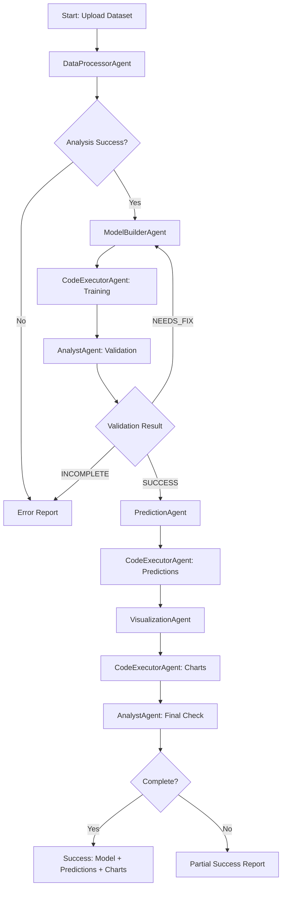

# MultiAgent AutoML System Documentation

## Table of Contents
1. [System Overview](#system-overview)
2. [System Architecture](#system-architecture)
3. [System Agents](#system-agents)
4. [Workflow (Pipeline)](#workflow-pipeline)
5. [Technical Components](#technical-components)
6. [Tools and Utilities](#tools-and-utilities)
7. [Configuration and Deployment](#configuration-and-deployment)
8. [API and Web Interface](#api-and-web-interface)
9. [Database and Persistence](#database-and-persistence)
10. [Security and Execution](#security-and-execution)

---

## System Overview

### What is the MultiAgent AutoML System?

This is a complete automated Machine Learning system that uses a multi-agent architecture with specialized agents to create, train and evaluate Machine Learning models autonomously. The system allows users to upload datasets, define training objectives and obtain trained models without requiring deep ML knowledge.

### Main Features

- **🤖 Fully Automated ML Pipeline**: From data analysis to prediction generation
- **👥 Multi-agent Architecture**: Each agent has a specific specialization
- **🌐 Complete Web Interface**: Dashboard for monitoring and job management
- **🐳 Secure Execution**: Uses Docker for code isolation
- **📊 H2O AutoML**: Integration with H2O for automated training
- **⚡ Real Time**: Live monitoring of training progress
- **🔄 Error Management**: Robust error detection and correction system

---

## System Architecture

### High-Level Diagram

```
┌─────────────────┐    ┌─────────────────┐    ┌─────────────────┐
│   Frontend Web  │────│   FastAPI App   │────│   SQLite DB     │
│   (HTML/JS)     │    │   (app.py)      │    │                 │
└─────────────────┘    └─────────────────┘    └─────────────────┘
                                │
                                │
                    ┌─────────────────┐
                    │   Pipeline      │
                    │   Orchestrator  │
                    │   (pipeline.py) │
                    └─────────────────┘
                                │
                ┌───────────────────────────────┐
                │        Agent Ecosystem        │
                │                               │
                │  ┌─────────────────────────┐  │
                │  │  DataProcessorAgent     │  │
                │  │  - CSV analysis         │  │
                │  │  - Format detection     │  │
                │  │  - Data validation      │  │
                │  └─────────────────────────┘  │
                │                               │
                │  ┌─────────────────────────┐  │
                │  │  ModelBuilderAgent      │  │
                │  │  - H2O script generation│  │
                │  │  - Code optimization    │  │
                │  │  - Error fixing         │  │
                │  └─────────────────────────┘  │
                │                               │
                │  ┌─────────────────────────┐  │
                │  │  CodeExecutorAgent      │  │
                │  │  - Docker execution     │  │
                │  │  - Package installation │  │
                │  │  - Output capture       │  │
                │  └─────────────────────────┘  │
                │                               │
                │  ┌─────────────────────────┐  │
                │  │  AnalystAgent           │  │
                │  │  - Quality validation   │  │
                │  │  - Error detection      │  │
                │  │  - Workflow decisions   │  │
                │  └─────────────────────────┘  │
                │                               │
                │  ┌─────────────────────────┐  │
                │  │  PredictionAgent        │  │
                │  │  - Future predictions   │  │
                │  │  - Model loading        │  │
                │  │  - CSV generation       │  │
                │  └─────────────────────────┘  │
                │                               │
                │  ┌─────────────────────────┐  │
                │  │  VisualizationAgent     │  │
                │  │  - Chart creation       │  │
                │  │  - Data plotting        │  │
                │  │  - Image generation     │  │
                │  └─────────────────────────┘  │
                └───────────────────────────────┘
                                │
                    ┌─────────────────┐
                    │  Docker Engine  │
                    │  - H2O Runtime  │
                    │  - Code Sandbox │
                    │  - File Isolation│
                    └─────────────────┘
```

### Component Interactions

The system follows a **Event-Driven Architecture** where:

1. **FastAPI App** receives HTTP requests and manages the web interface
2. **Pipeline Orchestrator** coordinates agent execution
3. **Agents** communicate through structured messages
4. **Docker** provides isolated execution environment
5. **Database** persists jobs, logs, and results

---

## System Agents

### 1. DataProcessorAgent
**Purpose**: Initial data analysis and format validation

**Capabilities**:
- CSV format detection (separators, encoding)
- Data type inference
- Missing value analysis
- Date column detection
- Statistical summaries
- Data quality reports

**Tools**:
- `get_file_sample_with_context()`: Get text sample from file
- `read_and_analyze_csv_with_context()`: Complete CSV analysis

**Output**: JSON report with data characteristics and recommendations

### 2. ModelBuilderAgent
**Purpose**: H2O AutoML script generation and optimization

**Capabilities**:
- Python script generation for H2O AutoML
- Feature engineering recommendations
- Model training configuration
- Error correction based on feedback
- Code optimization

**Input**: Data analysis report from DataProcessorAgent
**Output**: Complete Python script for model training

### 3. CodeExecutorAgent
**Purpose**: Secure script execution in Docker environment

**Capabilities**:
- Docker container management
- Automatic package installation
- Script execution monitoring
- Output capture and logging
- Error reporting

**Tools**:
- `execute_script_in_pipeline()`: Execute scripts with automatic dependencies

**Security**: Isolated execution, timeout control, resource limits

### 4. AnalystAgent
**Purpose**: Quality validation and workflow decisions

**Capabilities**:
- Code review and validation
- Execution log analysis
- Model quality assessment
- Error diagnosis
- Workflow decisions (continue/fix/retry)

**Tools**:
- `set_final_model_path()`: Register confirmed model path
- `check_generated_files()`: Verify output file generation

**Decision Logic**:
- **SUCCESS**: Forward to PredictionAgent
- **NEEDS_FIX**: Return to ModelBuilderAgent with corrections
- **INCOMPLETE**: Report missing requirements

### 5. PredictionAgent
**Purpose**: Future prediction generation

**Capabilities**:
- H2O model loading
- Future date generation
- Feature engineering for predictions
- Time series forecasting
- CSV output generation

**Input**: Trained model path from AnalystAgent
**Output**: `predictions.csv` with future forecasts

### 6. VisualizationAgent
**Purpose**: Chart and visualization creation

**Capabilities**:
- Historical data plotting
- Prediction visualization
- Chart customization
- High-quality image generation

**Input**: Historical data + `predictions.csv`
**Output**: `forecast_plot.png` with combined visualization

---

## Workflow (Pipeline)

### Sequential Execution Flow



### Detailed Step Description

#### Phase 1: Data Analysis
1. **DataProcessorAgent** analyzes the uploaded CSV
2. Detects format, encoding, separators
3. Generates comprehensive data report
4. Identifies potential target variables

#### Phase 2: Model Training (Iterative Loop)
1. **ModelBuilderAgent** generates H2O training script
2. **CodeExecutorAgent** executes script in Docker
3. **AnalystAgent** validates results and code quality
4. If issues found → return to step 1 with corrections
5. If successful → extract model path and proceed

#### Phase 3: Prediction Generation
1. **PredictionAgent** creates prediction script
2. **CodeExecutorAgent** runs predictions
3. Generates `predictions.csv` with future forecasts

#### Phase 4: Visualization
1. **VisualizationAgent** creates plotting script
2. **CodeExecutorAgent** generates charts
3. Produces `forecast_plot.png` with combined view

#### Phase 5: Final Validation
1. **AnalystAgent** verifies all outputs exist
2. Confirms file sizes and content validity
3. Marks pipeline as complete or reports issues

---

## Technical Components

### Core Technologies

- **Python 3.8+**: Main programming language
- **FastAPI**: Web framework for API and interface
- **SQLite**: Database for persistence
- **Docker**: Containerization for secure execution
- **H2O AutoML**: Automated machine learning engine
- **Pandas**: Data manipulation and analysis
- **Matplotlib**: Visualization and charting
- **AutoGen**: Multi-agent framework

### Key Dependencies

```txt
fastapi>=0.104.1
uvicorn[standard]>=0.24.0
pandas>=2.1.0
numpy>=1.24.0
h2o>=3.44.0
matplotlib>=3.7.0
scikit-learn>=1.3.0
python-multipart
python-dotenv
cryptography
psutil
pathlib
```

### File Structure

```
AutoML-Agent/
├── app.py                 # FastAPI main application
├── pipeline.py            # Pipeline orchestrator
├── config.py              # Configuration management
├── start.py               # Startup script
├── requirements.txt       # Python dependencies
├── Dockerfile            # Docker image definition
├── agents/               # Agent definitions
│   ├── __init__.py
│   ├── base_agent.py
│   ├── data_processor_agent.py
│   ├── model_builder_agent.py
│   ├── code_executor_agent.py
│   ├── analyst_agent.py
│   ├── prediction_agent.py
│   └── visualization_agent.py
├── prompts/              # System prompts for agents
│   ├── __init__.py
│   ├── data_processor_prompt.py
│   ├── model_builder_prompt.py
│   ├── analyst_prompt.py
│   ├── prediction_agent_prompt.py
│   ├── visualization_agent_prompt.py
│   └── pipeline_orchestrator_prompt.py
├── tools/                # Utility functions
│   ├── __init__.py
│   ├── script_execution.py
│   ├── file_analysis.py
│   ├── reporting.py
│   └── utils.py
├── static/               # Web interface files
│   ├── index.html
│   ├── app.js
│   └── styles.css
├── uploads/              # Dataset uploads
├── models/               # Saved ML models
├── results/              # Pipeline outputs
├── coding/               # Script execution workspace
└── test/                 # Test files
```

---

## Tools and Utilities

### Script Execution (`tools/script_execution.py`)

**Key Functions**:
- `execute_with_auto_install()`: Execute scripts with automatic package installation
- `create_script_execution_wrapper()`: Create pipeline-specific execution context
- `start_code_executor()` / `stop_code_executor()`: Manage Docker lifecycle

**Features**:
- Automatic Python package installation
- File persistence across Docker executions
- Execution timeout and resource limits
- Comprehensive error reporting

### File Analysis (`tools/file_analysis.py`)

**Key Functions**:
- `sample_data_and_get_info()`: Get file sample for format detection
- `read_and_analyze_csv()`: Complete CSV analysis with statistics
- `detect_decimal_separator()`: Automatic decimal separator detection
- `check_generated_files()`: Verify pipeline output files

**Capabilities**:
- Multiple encoding support (UTF-8, Latin-1, CP1252)
- Automatic separator detection (comma, semicolon, tab)
- Date column identification
- Data quality assessment

### Reporting (`tools/reporting.py`)

**Key Functions**:
- `MLPipelineLogger`: Comprehensive pipeline logging
- `log_agent_message()`: Structured agent communication logging
- `log_script_generated()`: Script generation tracking
- `track_agent_call()`: Agent usage statistics

**Features**:
- Multi-level logging (DEBUG, INFO, WARNING, ERROR)
- Structured data capture
- Performance metrics
- Database persistence

### Utilities (`tools/utils.py`)

**Key Functions**:
- `log_system_resources()`: System resource monitoring
- `PipelineContext`: Shared state management
- Performance tracking utilities

---

## Configuration and Deployment

### Environment Configuration (`config.py`)

```python
class Config:
    # API Keys
    OPENAI_API_KEY = "your_openai_key"
    DEEPSEEK_API_KEY = "your_deepseek_key"
    
    # Models
    OPENAI_MODEL = "gpt-4o-mini"
    
    # Database
    DATABASE_URL = "automl_system.db"
    
    # Docker
    DOCKER_IMAGE = "my-autogen-h2o:latest"
    CODE_EXECUTOR_TIMEOUT = 3000
    
    # Directories
    UPLOAD_DIR = "uploads"
    MODELS_DIR = "models"
    RESULTS_DIR = "results"
    CODING_DIR = "coding"
    
    # Server
    HOST = "0.0.0.0"
    PORT = 8006
    DEBUG = False
```

### Docker Setup

**Building the H2O Image**:
```bash
# Build H2O AutoML Docker image
docker build -t my-autogen-h2o:latest .
```

**Docker Features**:
- H2O AutoML pre-installed
- Python ML libraries included
- Isolated execution environment
- Volume mounting for file persistence
- Resource limits and timeouts

### Startup Process

**Using start.py**:
```bash
python start.py
```

**Startup Checks**:
- ✅ Required files verification
- ✅ Directory creation
- ✅ Dependency installation
- ✅ Docker availability check
- ✅ Environment configuration
- ✅ FastAPI server launch

---

## API and Web Interface

### REST API Endpoints

#### Job Management
- `POST /jobs` - Create new ML job
- `POST /jobs/{job_id}/upload` - Upload dataset
- `GET /jobs` - List all jobs
- `GET /jobs/{job_id}` - Get job details
- `DELETE /jobs/{job_id}` - Delete job
- `POST /jobs/{job_id}/retry` - Retry failed job

#### Monitoring
- `GET /jobs/{job_id}/logs` - Get execution logs
- `GET /jobs/{job_id}/messages` - Get agent messages
- `GET /jobs/{job_id}/statistics` - Get agent statistics
- `GET /jobs/{job_id}/reports` - Get process reports
- `GET /jobs/{job_id}/scripts` - Get generated scripts

#### Results
- `GET /jobs/{job_id}/models` - Get trained models
- `GET /models/{model_id}/download` - Download model
- `GET /jobs/{job_id}/predictions_csv` - Download predictions
- `GET /jobs/{job_id}/forecast_plot` - Get visualization
- `GET /jobs/{job_id}/results` - Get all results

#### Database Connections
- `POST /connections` - Add database connection
- `GET /connections` - List connections
- `POST /connections/{id}/test` - Test connection
- `DELETE /connections/{id}` - Remove connection

#### SQL Datasets
- `POST /datasets/sql` - Create SQL dataset
- `GET /datasets/sql` - List SQL datasets
- `GET /datasets/sql/{id}` - Get dataset data
- `DELETE /datasets/sql/{id}` - Delete dataset

### Web Interface Features

**Dashboard**:
- Job creation and monitoring
- Real-time progress tracking
- Log visualization
- Agent communication display

**Dataset Management**:
- File upload interface
- SQL connection management
- Dataset editing capabilities
- Preview and validation

**Results Visualization**:
- Interactive charts
- Model metrics display
- Prediction downloads
- Performance analytics

---

## Database and Persistence

### SQLite Schema

#### Jobs Table
```sql
CREATE TABLE jobs (
    id TEXT PRIMARY KEY,
    name TEXT NOT NULL,
    prompt TEXT NOT NULL,
    dataset_path TEXT NOT NULL,
    status TEXT DEFAULT 'created',
    created_at TIMESTAMP DEFAULT CURRENT_TIMESTAMP,
    updated_at TIMESTAMP DEFAULT CURRENT_TIMESTAMP,
    progress INTEGER DEFAULT 0,
    error_message TEXT,
    target_column TEXT
);
```

#### Models Table
```sql
CREATE TABLE models (
    id TEXT PRIMARY KEY,
    job_id TEXT NOT NULL,
    name TEXT NOT NULL,
    model_path TEXT NOT NULL,
    metrics TEXT,
    created_at TIMESTAMP DEFAULT CURRENT_TIMESTAMP,
    FOREIGN KEY (job_id) REFERENCES jobs (id)
);
```

#### Agent Messages Table
```sql
CREATE TABLE agent_messages (
    id INTEGER PRIMARY KEY AUTOINCREMENT,
    job_id TEXT NOT NULL,
    agent_name TEXT NOT NULL,
    content TEXT NOT NULL,
    message_type TEXT DEFAULT 'agent',
    timestamp TIMESTAMP DEFAULT CURRENT_TIMESTAMP,
    source TEXT DEFAULT 'agent',
    FOREIGN KEY (job_id) REFERENCES jobs (id)
);
```

#### Additional Tables
- `logs`: System and pipeline logs
- `predictions`: Prediction results
- `process_reports`: Detailed process reports
- `generated_scripts`: All generated code
- `agent_statistics`: Performance metrics
- `database_connections`: External DB connections
- `sql_datasets`: SQL-based datasets

### Data Persistence Strategy

**File Organization**:
```
coding/
├── pipeline_{job_id}/          # Job-specific workspace
│   ├── dataset.csv            # Input data
│   ├── training_script.py     # Generated training code
│   ├── model.zip              # Trained model
│   ├── predictions.csv        # Forecasts
│   ├── forecast_plot.png      # Visualization
│   └── execution_logs.txt     # Detailed logs
```

**Persistence Features**:
- Job isolation through unique workspaces
- Automatic file backup and recovery
- Cross-container file sharing
- Comprehensive audit trails

---

## Security and Execution

### Docker Security

**Isolation Features**:
- Containerized code execution
- No network access from containers
- Read-only code execution
- Resource limits (CPU, memory, disk)
- Execution timeouts

**Container Configuration**:
```dockerfile
# H2O AutoML Docker Environment
FROM python:3.9-slim

# Install H2O and ML dependencies
RUN pip install h2o pandas numpy scikit-learn matplotlib

# Create non-root user
RUN useradd -m automl
USER automl

# Set working directory
WORKDIR /workspace

# Configure resource limits
MEMORY 4GB
CPU 2 cores
TIMEOUT 30 minutes
```

### Input Validation

**Dataset Security**:
- File type validation (CSV only)
- Size limits (500MB max)
- Content scanning for malicious code
- Encoding validation

**Code Generation Security**:
- Template-based script generation
- No arbitrary code execution
- Predefined function libraries only
- Output sanitization

### Error Handling

**Robust Error Management**:
- Graceful failure handling
- Detailed error reporting
- Automatic retry mechanisms
- Fallback strategies

**Error Categories**:
- **Data Errors**: Format issues, missing columns
- **Execution Errors**: Runtime failures, timeouts
- **Model Errors**: Training failures, invalid metrics
- **System Errors**: Resource limits, Docker issues

### Monitoring and Logging

**Comprehensive Monitoring**:
- Real-time job progress tracking
- Resource usage monitoring
- Agent performance metrics
- Error rate tracking

**Logging Levels**:
- **DEBUG**: Detailed execution traces
- **INFO**: Normal operation events
- **WARNING**: Non-critical issues
- **ERROR**: Failures requiring attention

---

## Usage Examples

### Basic Workflow Example

1. **Start the System**:
```bash
python start.py
```

2. **Access Web Interface**:
Navigate to `http://localhost:8006`

3. **Create ML Job**:
- Upload CSV dataset
- Specify target column
- Set training objective
- Click "Start Training"

4. **Monitor Progress**:
- View real-time logs
- Track agent communications
- Monitor resource usage

5. **Download Results**:
- Trained model (ZIP)
- Predictions (CSV)
- Visualization (PNG)

### API Usage Example

```python
import requests

# Create job
job_data = {
    "name": "Sales Forecasting",
    "prompt": "Create a sales forecasting model",
    "target_column": "sales"
}
response = requests.post("http://localhost:8006/jobs", json=job_data)
job_id = response.json()["job_id"]

# Upload dataset
with open("sales_data.csv", "rb") as f:
    files = {"file": f}
    requests.post(f"http://localhost:8006/jobs/{job_id}/upload", files=files)

# Monitor progress
status = requests.get(f"http://localhost:8006/jobs/{job_id}")
print(f"Status: {status.json()['status']}")

# Download results when complete
predictions = requests.get(f"http://localhost:8006/jobs/{job_id}/predictions_csv")
with open("predictions.csv", "wb") as f:
    f.write(predictions.content)
```

### Advanced Configuration

**Custom Docker Image**:
```dockerfile
FROM my-autogen-h2o:latest

# Add custom ML libraries
RUN pip install tensorflow pytorch xgboost

# Custom configuration
ENV H2O_MAX_MEM=8G
ENV PYTHON_PATH=/workspace
```

**Environment Variables**:
```bash
export OPENAI_API_KEY="your_key_here"
export DOCKER_IMAGE="custom-h2o:latest"
export MAX_MODELS=50
export TIMEOUT=7200
```

---

## Troubleshooting

### Common Issues

**Docker Not Available**:
```bash
# Check Docker status
docker --version
docker info

# Start Docker service
sudo systemctl start docker
```

**H2O Memory Issues**:
```python
# Increase H2O memory in config.py
H2O_MAX_MEM = "8G"  # Increase from 4G
```

**Package Installation Failures**:
```bash
# Pre-install packages in Docker image
pip install --upgrade pip
pip install -r requirements.txt
```

**Permission Issues**:
```bash
# Fix directory permissions
sudo chown -R $USER:$USER ./coding ./uploads ./models
```

### Performance Optimization

**Speed Improvements**:
- Use SSD storage for working directories
- Increase Docker memory allocation
- Pre-install common packages in Docker image
- Use local model registry

**Resource Management**:
- Monitor system resources during training
- Adjust H2O memory based on dataset size
- Implement job queuing for multiple concurrent jobs
- Use GPU acceleration when available

---

## Contributing

### Development Setup

```bash
# Clone repository
git clone <repository-url>
cd AutoML-Agent

# Install dependencies
pip install -r requirements.txt

# Set up environment
cp .env.example .env
# Edit .env with your configuration

# Build Docker image
docker build -t my-autogen-h2o:latest .

# Run tests
python -m pytest test/

# Start development server
python start.py
```

### Code Standards

- Python 3.8+ compatibility
- Type hints for all functions
- Comprehensive docstrings
- Error handling for all operations
- Unit tests for core functionality

### Agent Development

**Creating New Agents**:
1. Define agent class in `agents/`
2. Create system prompt in `prompts/`
3. Add tools and capabilities
4. Update pipeline orchestration
5. Add comprehensive tests

**Best Practices**:
- Single responsibility principle
- Clear input/output specifications
- Robust error handling
- Comprehensive logging
- Performance optimization

---

This documentation provides a complete overview of the MultiAgent AutoML system. For specific implementation details, refer to the source code and inline documentation.
