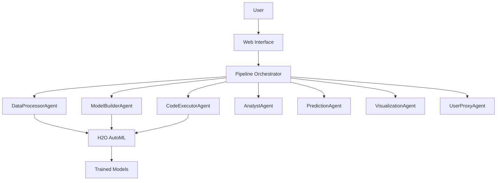

# Multi-Agent AutoML System

A complete automated Machine Learning system that uses **7 specialized AI agents** to transform raw data into production-ready ML models. Users can upload datasets, define objectives, and automatically obtain trained models using H2O AutoML. The system uses the open-source model `gpt-oss:120b` via Ollama or Hugging Face API, and does not require the OpenAI API.

## 🎯 What does this system do?

**From data to model in minutes**: Upload a CSV, describe what you want to predict, and get a trained model with predictions and visualizations automatically.

## 🚀 Main Features

🤖 **ML Pipeline with 7 AI Agents**
- **DataProcessorAgent**: Automatic dataset analysis
- **ModelBuilderAgent**: Python code generation + H2O AutoML  
- **CodeExecutorAgent**: Safe execution in Docker
- **AnalystAgent**: Quality control and validation
- **PredictionAgent**: Prediction generation
- **VisualizationAgent**: Chart creation
- **UserProxyAgent**: General coordination

📊 **Complete Web Dashboard**
- Real-time training monitoring
- Interactive ML job management
- Model metrics visualization
- Detailed log viewer

🔄 **Fully Automated Workflow**
- Dataset upload (CSV/Excel)
- Natural language objective definition
- Automatic feature engineering
- Model training and validation
- Prediction generation
- Results visualization

📈 **Advanced Features**
- Job queue management
- Model versioning and storage
- Complete training history
- Model download and deployment

## Quick Start

### Prerequisites

- Python 3.8+
- Docker (for H2O execution environment)
- Ollama (for local LLM inference) **or** Hugging Face API key (for remote inference)

### Installation

1. **Clone/Download the project**
```bash
git clone <repository-url>
cd Agent-AutoML
```

2. **Install dependencies**
```bash
pip install -r requirements.txt
```

3. **Configure environment**
If using Hugging Face API, create a `.env` file with:
```
HF_TOKEN=your_huggingface_api_token_here
```
If using Ollama, make sure the Ollama server is running locally and the `gpt-oss:120b` model is available.

4. **Start the application**
```bash
python start.py
```
The system will automatically use Ollama (local) or Hugging Face (cloud) for LLM inference with `gpt-oss:120b`.

5. **Access the web interface**
Open `http://localhost:8006` in your browser

## Architecture

### Multi-Agent System
The system uses 7 specialized agents that work together:



### Execution Flow

1. **Data Upload & Analysis**
   - User uploads CSV file
   - DataProcessorAgent analyzes dataset structure
   - Automatic data type detection and validation

2. **Model Generation**
   - ModelBuilderAgent generates training code
   - Integration with H2O AutoML for optimal models
   - Automatic hyperparameter optimization

3. **Safe Execution**
   - CodeExecutorAgent runs code in Docker container
   - Real-time log monitoring
   - Error handling and recovery

4. **Quality Control**
   - AnalystAgent validates results
   - Model performance evaluation
   - Recommendation generation

5. **Predictions & Visualization**
   - PredictionAgent generates forecasts
   - VisualizationAgent creates charts
   - Interactive result presentation

## Usage Examples

### Example 1: Sales Prediction
```python
# 1. Upload sales data (sales.csv)
# 2. Set objective: "Predict monthly sales"
# 3. System automatically:
#    - Analyzes seasonal patterns
#    - Trains time series models
#    - Generates future predictions
#    - Creates trend visualizations
```

### Example 2: Customer Classification
```python
# 1. Upload customer data
# 2. Set objective: "Classify customer type"
# 3. System automatically:
#    - Performs feature engineering
#    - Trains classification models
#    - Evaluates accuracy
#    - Provides customer insights
```

## API Reference

### Main Endpoints

#### POST /pipeline/start
Start a new ML pipeline
```json
{
  "file_path": "path/to/dataset.csv",
  "user_objective": "Predict sales for next 3 months",
  "pipeline_name": "sales_forecast_2024"
}
```

#### GET /pipeline/status/{pipeline_id}
Get pipeline execution status
```json
{
  "status": "running",
  "current_stage": "model_training",
  "progress": 65,
  "logs": [...],
  "results": {...}
}
```

#### GET /models/{model_id}/predict
Make predictions with trained model
```json
{
  "predictions": [...],
  "confidence": 0.95,
  "feature_importance": {...}
}
```

## Configuration

### Environment Variables
- `HF_TOKEN`: Hugging Face API key (if using Hugging Face for LLM)
- `DOCKER_ENABLED`: Enable/disable Docker execution (default: true)
- `MAX_TOKENS`: Maximum tokens per agent response (default: 4000)
- `LOG_LEVEL`: Logging level (INFO, DEBUG, ERROR)

### Agent Configuration
Each agent can be configured in `config.py`:
```python
AGENT_CONFIG = {
    "data_processor": {
        "max_sample_size": 10000,
        "analysis_depth": "detailed"
    },
    "model_builder": {
        "max_models": 10,
        "training_time": 300
    }
}
```

## Advanced Features

### Custom Models
The system supports custom model integration:
```python
# Register custom model
from agents.model_builder_agent import ModelBuilderAgent

agent = ModelBuilderAgent()
agent.register_custom_model("custom_xgb", custom_xgb_trainer)
```

### Pipeline Extensions
Add custom processing steps:
```python
# Custom preprocessing
def custom_preprocessor(df):
    # Your custom logic here
    return processed_df

pipeline.add_step("custom_preprocessing", custom_preprocessor)
```

## Monitoring & Debugging

### Real-time Logs
Monitor execution through the web interface or API:
```bash
curl http://localhost:8000/pipeline/logs/{pipeline_id}
```

### Performance Metrics
Access detailed performance data:
- Training time per stage
- Memory usage
- Model accuracy metrics
- Prediction confidence intervals

### Error Handling
The system includes comprehensive error handling:
- Automatic retry on transient failures
- Graceful degradation for resource limits
- Detailed error reporting and logging

## Deployment

### Docker Deployment
```dockerfile
# Use provided Dockerfile
docker build -t automl-system .
docker run -p 8000:8000 -e  automl-system
```

### Production Considerations
- Configure reverse proxy (nginx/traefik)
- Set up monitoring (Prometheus/Grafana)
- Implement backup strategies for models
- Scale Docker containers as needed

## Troubleshooting

### Common Issues

1. **Ollama API Errors**
   - Verify API is valid
   - Download the model using ollama run gpt-oss:120b
   - Make sure your hardware is adequate

2. **Docker Execution Issues**
   - Verify Docker is running
   - Check container permissions
   - Monitor disk space

3. **Memory Issues**
   - Reduce sample size for large datasets
   - Limit concurrent pipelines
   - Increase container memory limits

### Debug Mode
Enable debug logging:
```bash
export LOG_LEVEL=DEBUG
python start.py
```

## Contributing

### Development Setup
```bash
# Install development dependencies
pip install -r requirements-dev.txt

```

### Adding New Agents
1. Create agent class inheriting from `BaseAgent`
2. Implement required methods
3. Add agent to pipeline configuration
4. Write tests for new functionality

## License
OSS/Apache License

## Support

- **Documentation**: Check the `/docs` folder for detailed guides
- **Issues**: Report bugs and feature requests on GitHub

## Roadmap

### Version 2.0 (Planned)
- [ ] Multi-modal data support (images, text)
- [ ] AutoML for deep learning
- [ ] Model interpretability tools
- [ ] Advanced ensemble methods

### Version 2.1 (Future)
- [ ] Distributed training support
- [ ] Cloud deployment templates
- [ ] Integration with MLflow
- [ ] Real-time streaming predictions

---

**Built with ❤️ using AutoGen, H2O AutoML, FastAPI, Docker, and gpt-oss:120b (Ollama/Hugging Face)**
