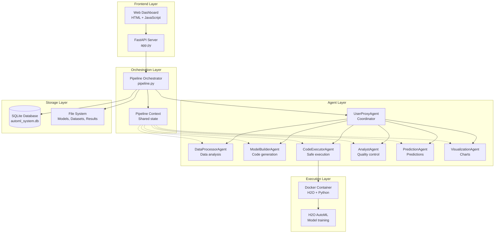
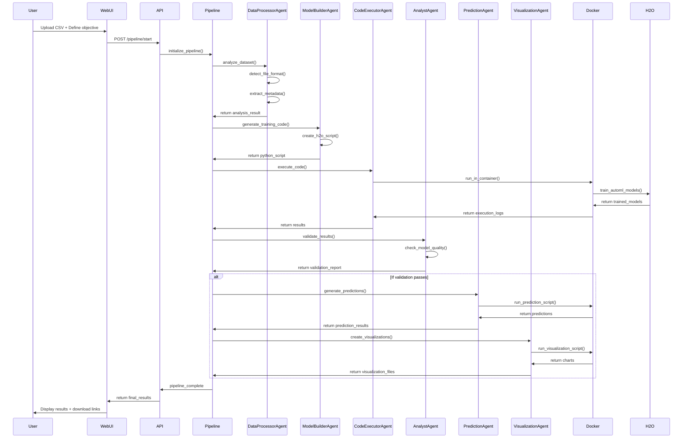
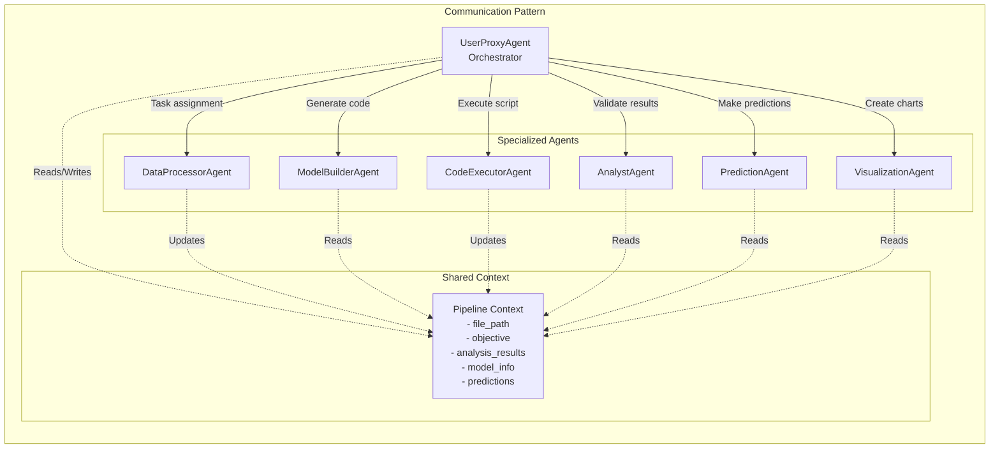
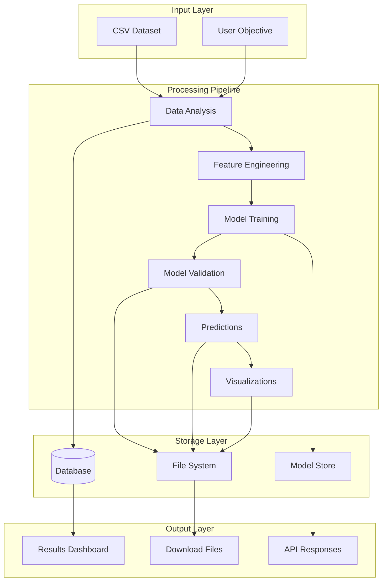
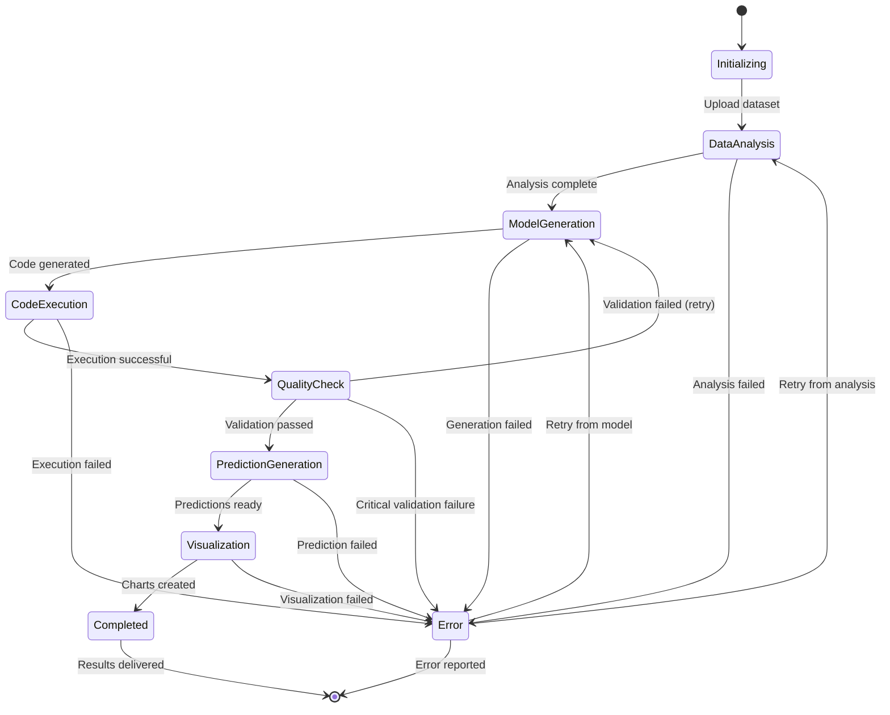
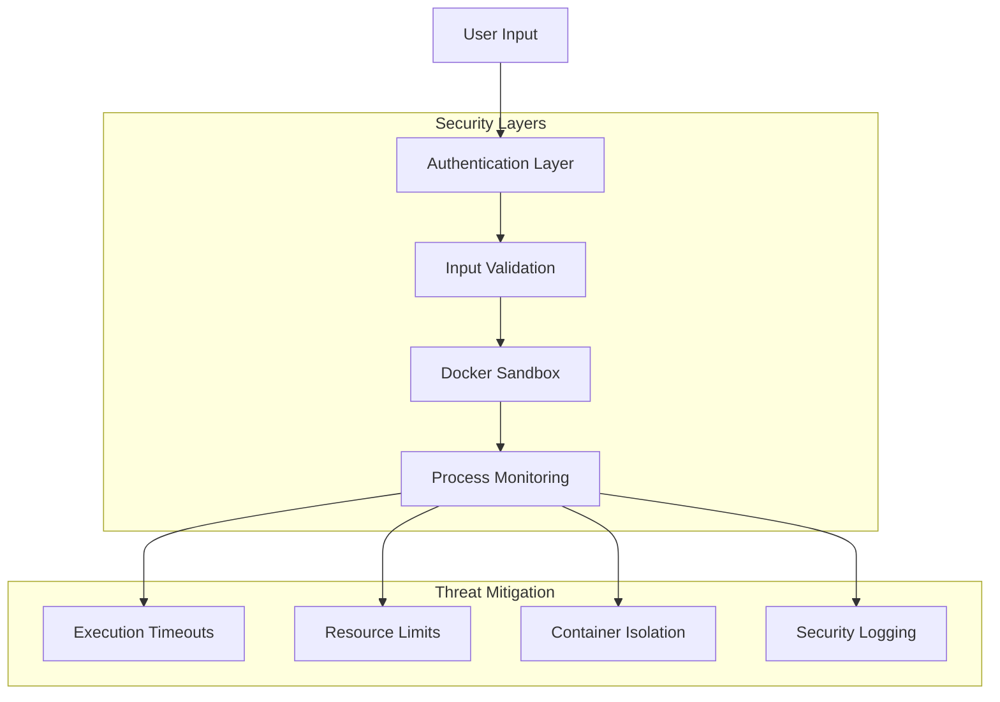
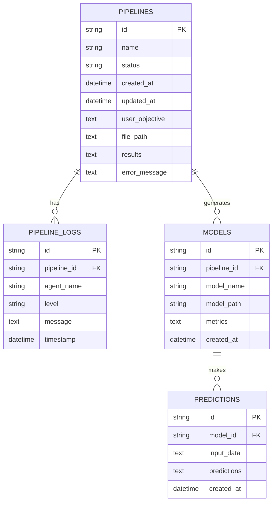

# Multi-Agent AutoML System Diagrams

## General Architecture Diagram



## Detailed Execution Flow



## Agent Communication Pattern



## Data Flow Architecture



## Docker Execution Environment

```mermaid
graph TB
    subgraph "Host System"
        API[FastAPI Application]
        AGENTS[Agent System]
    end
    
    subgraph "Docker Container"
        PYTHON[Python 3.10]
        H2O_LIB[H2O AutoML Library]
        PANDAS[Pandas + NumPy]
        MATPLOTLIB[Matplotlib + Seaborn]
        WORKSPACE[/workspace<br/>Mounted Volume]
    end
    
    subgraph "Execution Flow"
        SCRIPT[Generated Script]
        EXECUTION[Script Execution]
        RESULTS[Output Files]
        LOGS[Execution Logs]
    end
    
    AGENTS -->|"Generate & Send"| SCRIPT
    SCRIPT --> EXECUTION
    EXECUTION --> RESULTS
    EXECUTION --> LOGS
    
    API -.->|"Volume Mount"| WORKSPACE
    WORKSPACE --> SCRIPT
    RESULTS --> WORKSPACE
    LOGS --> WORKSPACE
```

## State Management



## Security Architecture



## Database Schema



## Performance Monitoring

```mermaid
graph TB
    subgraph "Metrics Collection"
        TIME[Execution Time]
        MEMORY[Memory Usage]
        CPU[CPU Usage]
        DISK[Disk I/O]
    end
    
    subgraph "Agent Performance"
        DATA_TIME[Data Analysis Time]
        MODEL_TIME[Model Training Time]
        PRED_TIME[Prediction Time]
        VIZ_TIME[Visualization Time]
    end
    
    subgraph "System Health"
        QUEUE[Pipeline Queue Length]
        ACTIVE[Active Containers]
        ERROR_RATE[Error Rate]
        SUCCESS_RATE[Success Rate]
    end
    
    TIME --> MONITORING[Performance Dashboard]
    MEMORY --> MONITORING
    CPU --> MONITORING
    DISK --> MONITORING
    
    DATA_TIME --> MONITORING
    MODEL_TIME --> MONITORING
    PRED_TIME --> MONITORING
    VIZ_TIME --> MONITORING
    
    QUEUE --> MONITORING
    ACTIVE --> MONITORING
    ERROR_RATE --> MONITORING
    SUCCESS_RATE --> MONITORING
```


