# Introduction to the Multi-Agent AutoML System

## 🎯 What is the Multi-Agent AutoML System?

The **Multi-Agent AutoML System** is a complete automated Machine Learning platform that uses **7 specialized AI agents** to transform raw data into production-ready ML models. The system is designed to eliminate the technical complexity of Machine Learning model development, allowing users without technical experience to create professional predictive models.

## 🌟 Key Features

### 🤖 **Complete Automation**
- **Zero manual intervention**: From data upload to final predictions
- **Automatic data analysis**: Intelligent detection of data types and patterns
- **Automatic code generation**: Optimized Python scripts for each use case
- **Automatic training**: Integration with H2O AutoML for optimal models

### 👥 **Intelligent Multi-Agent System**
- **7 specialized agents** working in collaboration
- **Inter-agent communication** for continuous optimization
- **Cross-validation** between agents to ensure quality
- **Automatic error recovery** with intelligent feedback

### 🔒 **Security and Reliability**
- **Docker container execution** for complete isolation
- **Code validation** before execution
- **Detailed logs** for auditing and debugging
- **Robust error handling** with automatic retries

### 📊 **Complete Web Interface**
- **Real-time dashboard** for job monitoring
- **Visual ML pipeline management**
- **Automatic result visualization**
- **Trained model download**

## 🎯 Who is This System For?

### 👨‍💼 **Business Analysts**
- Create predictive models without technical knowledge
- Get quick insights from business data
- Generate automatic reports with visualizations

### 👩‍💻 **Data Scientists**
- Accelerate model prototyping process
- Automate repetitive ML pipeline tasks
- Focus time on high-value analysis

### 🏢 **IT Teams**
- Democratize Machine Learning access in the organization
- Implement scalable and secure ML solutions
- Reduce dependency on specialized resources

### 🎓 **Students and Educators**
- Learn ML concepts with practical examples
- Experiment with different model types
- Understand the complete flow of an ML project

## 🚀 What Does the System Do?

### **Automated Workflow**

```mermaid
graph LR
    A[📁 Upload CSV] --> B[🔍 Automatic Analysis]
    B --> C[🧠 ML Training]
    C --> D[📊 Predictions]
    D --> E[📈 Visualizations]
    E --> F[📋 Final Results]
```

1. **📁 Data Upload**: Upload a CSV file with your data
2. **🔍 Automatic Analysis**: System analyzes structure, data types and patterns
3. **🧠 Training**: Generates and trains multiple models automatically
4. **📊 Predictions**: Creates future predictions based on the best model
5. **📈 Visualizations**: Generates professional result charts
6. **📋 Results**: Delivers models, predictions and visualizations ready to use

### **Types of Problems It Solves**

#### 📈 **Time Series Prediction**
- Future sales
- Product demand
- Market trends
- Financial projections

#### 🎯 **Classification**
- Customer segmentation
- Fraud detection
- Sentiment analysis
- Product classification

#### 📊 **Regression**
- Price prediction
- Cost estimation
- Risk analysis
- Process optimization

## 🔧 Technologies Used

### **Backend**
- **Python 3.8+**: Main language
- **FastAPI**: Modern and fast web framework
- **H2O AutoML**: Automated Machine Learning engine
- **Docker**: Containers for secure execution
- **SQLite**: Lightweight and fast database

### **Artificial Intelligence**
- **gpt-oss:120b**: Open source language model
- **Ollama**: Local LLM execution
- **Hugging Face API**: Cloud alternative for LLMs
- **AutoGen**: Microsoft's multi-agent framework

### **Frontend**
- **HTML5/CSS3/JavaScript**: Modern web interface
- **Charts.js**: Interactive visualizations
- **Bootstrap**: Responsive design

## 🌟 Key Benefits

### ⚡ **Speed**
- **From hours to minutes**: Reduces ML model development time
- **Complete automation**: Eliminates repetitive manual tasks
- **Parallel processing**: Multiple agents working simultaneously

### 💰 **Cost-Effectiveness**
- **No expert needed**: Democratizes ML access
- **Minimal infrastructure**: Works on standard hardware
- **Open Source**: No licensing costs

### 🎯 **Quality**
- **Automatic best practices**: Implements professional ML techniques
- **Continuous validation**: Quality control at every step
- **Optimized models**: Uses H2O AutoML for maximum performance

### 🔄 **Scalability**
- **Modular architecture**: Easy to extend and customize
- **Flexible deployment**: Local, cloud or hybrid
- **REST API**: Simple integration with other systems

## 🎉 Ready to Get Started?

The Multi-Agent AutoML System is designed to be **easy to use** but **powerful in capabilities**. In the following chapters of this documentation you will find:

- **Step-by-step installation guide**
- **Complete tutorial** with real examples
- **Detailed documentation** of each component
- **Practical use cases** for your industry

### **Next Steps**

1. 📖 Read the [**System Architecture**](02_architecture.md) to understand how it works
2. 🛠️ Follow the [**Installation Guide**](03_installation.md) to set up the system
3. 🚀 Complete the [**Quick Start Guide**](04_quick_start.md) with your first model

---

**Welcome to the future of automated Machine Learning! 🎯🤖**