# Introducción al Sistema Multi-Agent AutoML

## 🎯 ¿Qué es el Sistema Multi-Agent AutoML?

El **Sistema Multi-Agent AutoML** es una plataforma completa de Machine Learning automatizado que utiliza **7 agentes especializados de IA** para transformar datos brutos en modelos de ML listos para producción. El sistema está diseñado para eliminar la complejidad técnica del desarrollo de modelos de Machine Learning, permitiendo a usuarios sin experiencia técnica crear modelos predictivos profesionales.

## 🌟 Características Principales

### 🤖 **Automatización Completa**
- **Cero intervención manual**: Desde la carga de datos hasta las predicciones finales
- **Análisis automático de datos**: Detección inteligente de tipos de datos y patrones
- **Generación automática de código**: Scripts de Python optimizados para cada caso de uso
- **Entrenamiento automático**: Integración con H2O AutoML para modelos óptimos

### 👥 **Sistema Multi-Agente Inteligente**
- **7 agentes especializados** que trabajan en colaboración
- **Comunicación entre agentes** para optimización continua
- **Validación cruzada** entre agentes para garantizar calidad
- **Recuperación automática de errores** con retroalimentación inteligente

### 🔒 **Seguridad y Confiabilidad**
- **Ejecución en contenedores Docker** para aislamiento completo
- **Validación de código** antes de la ejecución
- **Logs detallados** para auditoría y debugging
- **Manejo robusto de errores** con reintentos automáticos

### 📊 **Interfaz Web Completa**
- **Dashboard en tiempo real** para monitoreo de trabajos
- **Gestión visual de pipelines** ML
- **Visualización automática** de resultados
- **Descarga de modelos** entrenados

## 🎯 ¿Para Quién es Este Sistema?

### 👨‍💼 **Analistas de Negocio**
- Crear modelos predictivos sin conocimientos técnicos
- Obtener insights rápidos de datos empresariales
- Generar reportes automáticos con visualizaciones

### 👩‍💻 **Científicos de Datos**
- Acelerar el proceso de prototipado de modelos
- Automatizar tareas repetitivas del pipeline ML
- Enfocar tiempo en análisis de alto valor

### 🏢 **Equipos de TI**
- Democratizar el acceso a Machine Learning en la organización
- Implementar soluciones ML escalables y seguras
- Reducir la dependencia de recursos especializados

### 🎓 **Estudiantes y Educadores**
- Aprender conceptos de ML con ejemplos prácticos
- Experimentar con diferentes tipos de modelos
- Entender el flujo completo de un proyecto ML

## 🚀 ¿Qué Hace el Sistema?

### **Flujo de Trabajo Automatizado**

```mermaid
graph LR
    A[📁 Cargar CSV] --> B[🔍 Análisis Automático]
    B --> C[🧠 Entrenamiento ML]
    C --> D[📊 Predicciones]
    D --> E[📈 Visualizaciones]
    E --> F[📋 Resultados Finales]
```

1. **📁 Carga de Datos**: Sube un archivo CSV con tus datos
2. **🔍 Análisis Automático**: El sistema analiza estructura, tipos de datos y patrones
3. **🧠 Entrenamiento**: Genera y entrena múltiples modelos automáticamente
4. **📊 Predicciones**: Crea predicciones futuras basadas en el mejor modelo
5. **📈 Visualizaciones**: Genera gráficos profesionales de resultados
6. **📋 Resultados**: Entrega modelos, predicciones y visualizaciones listos para usar

### **Tipos de Problemas que Resuelve**

#### 📈 **Predicción de Series Temporales**
- Ventas futuras
- Demanda de productos
- Tendencias de mercado
- Proyecciones financieras

#### 🎯 **Clasificación**
- Segmentación de clientes
- Detección de fraudes
- Análisis de sentimientos
- Clasificación de productos

#### 📊 **Regresión**
- Predicción de precios
- Estimación de costos
- Análisis de riesgo
- Optimización de procesos

## 🔧 Tecnologías Utilizadas

### **Backend**
- **Python 3.8+**: Lenguaje principal
- **FastAPI**: Framework web moderno y rápido
- **H2O AutoML**: Motor de Machine Learning automatizado
- **Docker**: Contenedores para ejecución segura
- **SQLite**: Base de datos ligera y rápida

### **Inteligencia Artificial**
- **gpt-oss:120b**: Modelo de lenguaje open source
- **Ollama**: Ejecución local de LLMs
- **Hugging Face API**: Alternativa cloud para LLMs
- **AutoGen**: Framework multi-agente de Microsoft

### **Frontend**
- **HTML5/CSS3/JavaScript**: Interfaz web moderna
- **Charts.js**: Visualizaciones interactivas
- **Bootstrap**: Diseño responsive

## 🌟 Beneficios Clave

### ⚡ **Velocidad**
- **De horas a minutos**: Reduce el tiempo de desarrollo de modelos ML
- **Automatización completa**: Elimina tareas manuales repetitivas
- **Procesamiento paralelo**: Múltiples agentes trabajando simultáneamente

### 💰 **Costo-Efectividad**
- **Sin necesidad de expertos**: Democratiza el acceso a ML
- **Infraestructura mínima**: Funciona en hardware estándar
- **Open Source**: Sin costos de licenciamiento

### 🎯 **Calidad**
- **Mejores prácticas automáticas**: Implementa técnicas ML profesionales
- **Validación continua**: Control de calidad en cada paso
- **Modelos optimizados**: Utiliza H2O AutoML para máximo rendimiento

### 🔄 **Escalabilidad**
- **Arquitectura modular**: Fácil de extender y personalizar
- **Deployment flexible**: Local, cloud o híbrido
- **API REST**: Integración sencilla con otros sistemas

## 🎉 ¿Listo para Comenzar?

El Sistema Multi-Agent AutoML está diseñado para ser **fácil de usar** pero **poderoso en capacidades**. En los siguientes capítulos de esta documentación encontrarás:

- **Guía de instalación** paso a paso
- **Tutorial completo** con ejemplos reales
- **Documentación detallada** de cada componente
- **Casos de uso prácticos** para tu industria

### **Próximos Pasos**

1. 📖 Leer la [**Arquitectura del Sistema**](02_architecture.md) para entender cómo funciona
2. 🛠️ Seguir la [**Guía de Instalación**](03_installation.md) para configurar el sistema
3. 🚀 Completar la [**Guía de Inicio Rápido**](04_quick_start.md) con tu primer modelo

---

**¡Bienvenido al futuro del Machine Learning automatizado! 🎯🤖**