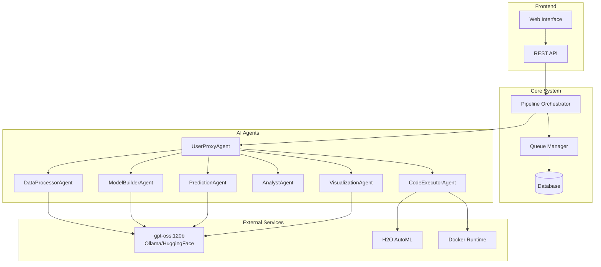
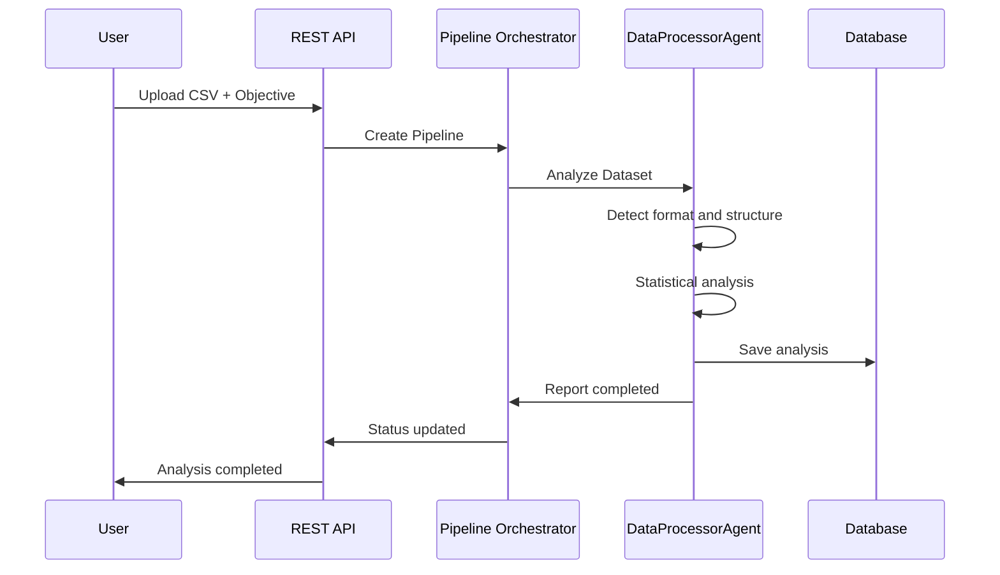
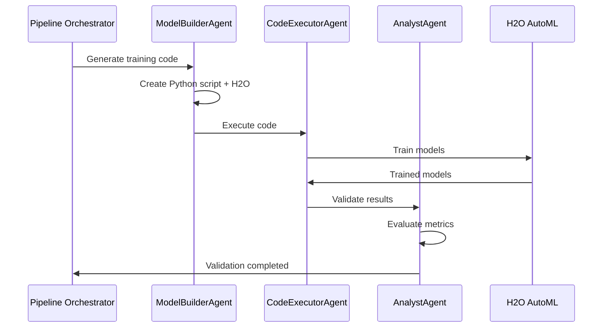
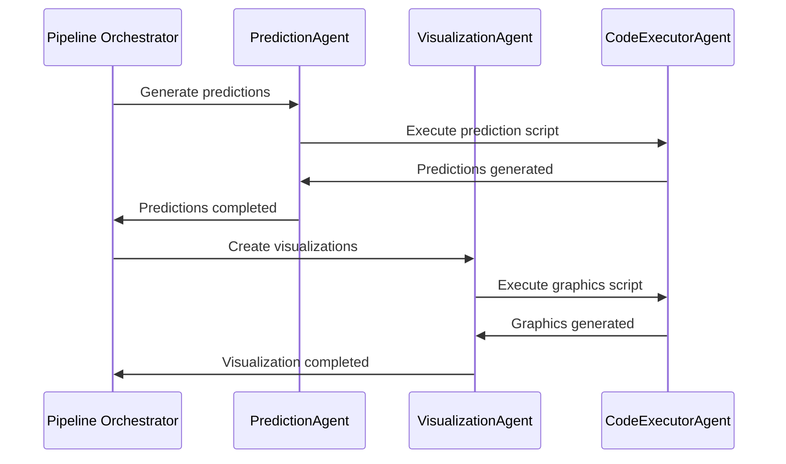
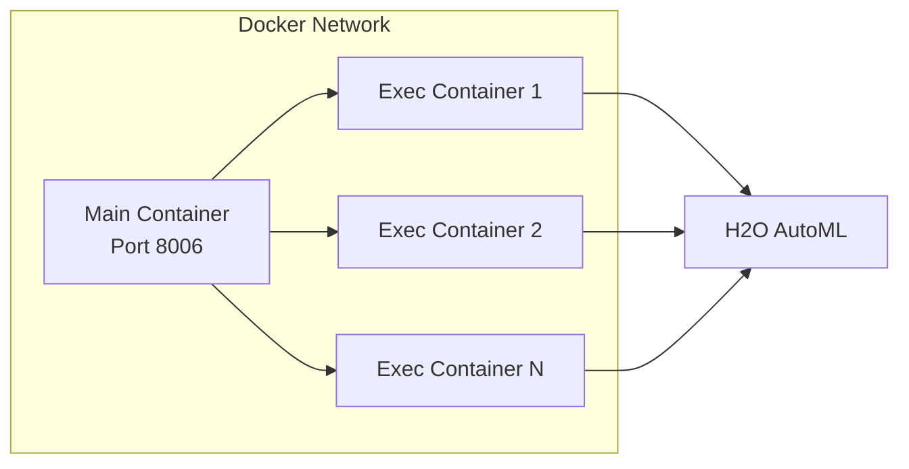

# Multi-Agent AutoML System Architecture

## 🏗️ Architecture Overview

The Multi-Agent AutoML System is built with a **modular and distributed architecture** that enables scalability, maintainability, and extensibility. The system uses a **microservices approach with specialized agents** that collaborate to complete the Machine Learning pipeline.

## 🎯 Design Principles

### 🔄 **Separation of Concerns**
- Each agent has a specific and well-defined function
- Communication between agents through standard interfaces
- Loose coupling between components

### 🛡️ **Security by Design**
- Isolated execution in Docker containers
- Input validation at all points
- Detailed logs for auditing

### 📈 **Horizontal Scalability**
- Stateless architecture allows multiple instances
- Job queue for load handling
- Database optimized for concurrency

## 🏛️ High-Level Architecture



## 🎭 The 7 Specialized Agents

### 🤝 **UserProxyAgent**
**Role**: General system coordinator
- **Responsibilities**:
  - Workflow orchestration
  - Inter-agent communication
  - Error handling and retries
  - Progress reporting to user

### 📊 **DataProcessorAgent**
**Role**: Data analysis specialist
- **Responsibilities**:
  - Automatic separator and encoding detection
  - Statistical dataset analysis
  - Data type identification
  - Null values and outliers detection
  - Target column suggestion

### 🧠 **ModelBuilderAgent**
**Role**: ML model architect
- **Responsibilities**:
  - Python code generation for H2O AutoML
  - Appropriate algorithm selection
  - Hyperparameter configuration
  - Training pipeline optimization

### ⚡ **CodeExecutorAgent**
**Role**: Secure code executor
- **Responsibilities**:
  - Code execution in Docker containers
  - Automatic dependency installation
  - Resource and timeout monitoring
  - Log and error capture

### 🔍 **AnalystAgent**
**Role**: Quality inspector
- **Responsibilities**:
  - Generated code validation
  - Model results evaluation
  - Performance metrics analysis
  - Recommendation generation

### 🎯 **PredictionAgent**
**Role**: Prediction generator
- **Responsibilities**:
  - Trained model loading
  - Future data generation
  - Model application for predictions
  - Confidence interval calculation

### 📈 **VisualizationAgent**
**Role**: Visualization creator
- **Responsibilities**:
  - Professional chart generation
  - Historical and prediction data combination
  - Multiple format export
  - Device optimization

## 🔄 System Data Flow

### **Phase 1: Ingestion and Analysis**


### **Phase 2: Model Training**


### **Phase 3: Predictions and Visualization**


## 🗄️ Data Architecture

### **Main Database (SQLite)**
```sql
-- ML Pipelines
CREATE TABLE pipelines (
    id TEXT PRIMARY KEY,
    name TEXT,
    status TEXT,
    user_objective TEXT,
    file_path TEXT,
    created_at TIMESTAMP,
    updated_at TIMESTAMP
);

-- Individual jobs per agent
CREATE TABLE jobs (
    id TEXT PRIMARY KEY,
    pipeline_id TEXT,
    agent_name TEXT,
    status TEXT,
    input_data TEXT,
    output_data TEXT,
    logs TEXT,
    created_at TIMESTAMP
);

-- Trained models
CREATE TABLE models (
    id TEXT PRIMARY KEY,
    pipeline_id TEXT,
    model_type TEXT,
    metrics TEXT,
    file_path TEXT,
    created_at TIMESTAMP
);

-- Generated predictions
CREATE TABLE predictions (
    id TEXT PRIMARY KEY,
    model_id TEXT,
    prediction_data TEXT,
    confidence_interval TEXT,
    created_at TIMESTAMP
);
```

### **File System**
```
├── uploads/          # User uploaded datasets
├── models/           # Saved trained models
├── results/          # Predictions and results
├── visualizations/   # Generated charts
├── coding/           # Agent-generated scripts
│   └── pipeline_id/  # Pipeline-specific scripts
└── logs/            # System logs
```

## 🐳 Container Architecture

### **Main Container (System)**
```dockerfile
FROM python:3.8-slim
# FastAPI + Agents + Database
EXPOSE 8006
```

### **Execution Containers (Dynamic)**
```dockerfile
FROM python:3.8
# Automatic dependency installation
# Isolated execution of generated code
```

### **Container Network**


## 🔌 External Integrations

### **Language Models**
```python
# Dual configuration: Local + Cloud
LLM_CONFIG = {
    "primary": "ollama",      # Local with gpt-oss:120b
    "fallback": "huggingface", # Cloud API
    "model": "gpt-oss:120b"
}
```

### **H2O AutoML**
```python
# Automatic integration
h2o.init()
aml = H2OAutoML(
    max_models=20,
    seed=42,
    max_runtime_secs=1800,
    sort_metric="RMSE"
)
```

## 📊 Monitoring and Observability

### **System Metrics**
- Response time per agent
- Resource usage (CPU, memory)
- Pipeline success rate
- Prediction latency

### **Structured Logs**
```json
{
  "timestamp": "2024-01-01T10:00:00Z",
  "level": "INFO",
  "agent": "DataProcessorAgent",
  "pipeline_id": "pipeline_123",
  "message": "Dataset analysis completed",
  "metrics": {
    "rows": 10000,
    "columns": 15,
    "processing_time": 45.2
  }
}
```

## 🔒 Security Considerations

### **Execution Isolation**
- Docker containers with limited resources
- Isolated network for code execution
- Automatic timeout to prevent infinite loops

### **Input Validation**
- Filename sanitization
- Dataset format validation
- File size limits

### **Auditing**
- Log all operations
- Complete pipeline traceability
- Configurable log retention

## 🚀 Scalability and Performance

### **Horizontal Scalability**
- Multiple instances of main service
- Load balancer for traffic distribution
- Database with connection pooling

### **Optimizations**
- Frequent result caching
- Asynchronous job processing
- Large data compression

---

This architecture provides a solid foundation for an automated Machine Learning system that is **scalable**, **secure** and **maintainable**.

**Next**: [Installation and Configuration](03_installation.md)