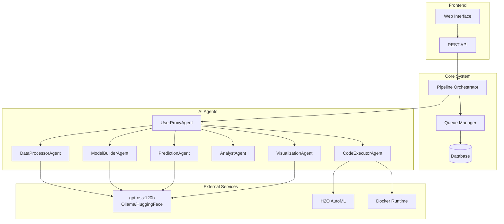
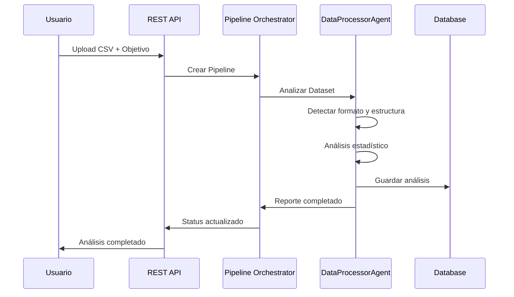
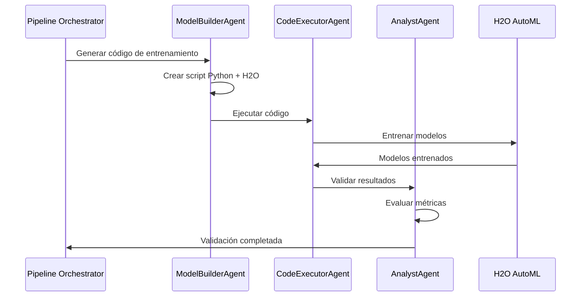
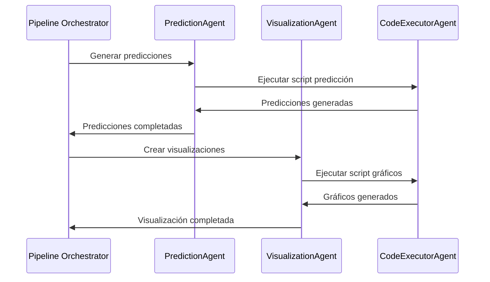
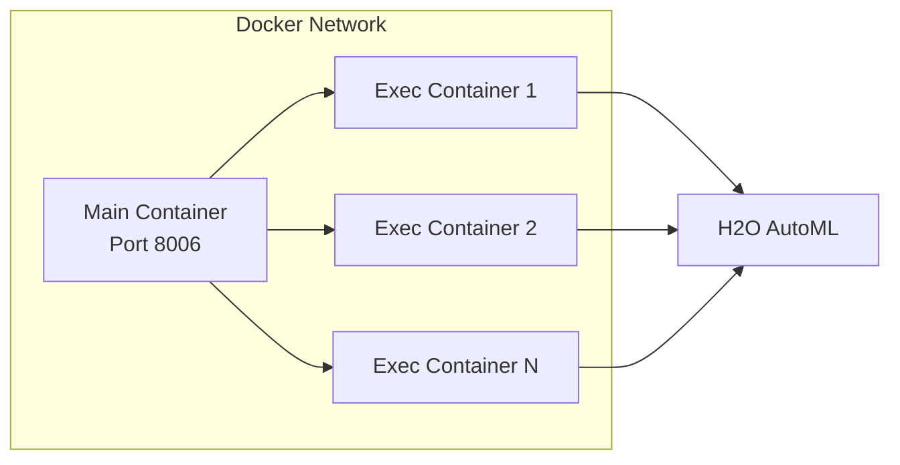

# Arquitectura del Sistema Multi-Agent AutoML

## 🏗️ Visión General de la Arquitectura

El Sistema Multi-Agent AutoML está construido con una **arquitectura modular y distribuida** que permite escalabilidad, mantenibilidad y extensibilidad. El sistema utiliza un enfoque de **microservicios con agentes especializados** que colaboran para completar el pipeline de Machine Learning.

## 🎯 Principios de Diseño

### 🔄 **Separación de Responsabilidades**
- Cada agente tiene una función específica y bien definida
- Comunicación entre agentes a través de interfaces estándar
- Acoplamiento débil entre componentes

### 🛡️ **Seguridad por Diseño**
- Ejecución aislada en contenedores Docker
- Validación de entrada en todos los puntos
- Logs detallados para auditoría

### 📈 **Escalabilidad Horizontal**
- Arquitectura stateless permite múltiples instancias
- Cola de trabajos para manejar carga
- Base de datos optimizada para concurrencia

## 🏛️ Arquitectura de Alto Nivel



## 🎭 Los 7 Agentes Especializados

### 🤝 **UserProxyAgent**
**Rol**: Coordinador general del sistema
- **Responsabilidades**:
  - Orquestación del flujo de trabajo
  - Comunicación entre agentes
  - Gestión de errores y reintentos
  - Reporte de progreso al usuario

### 📊 **DataProcessorAgent**
**Rol**: Especialista en análisis de datos
- **Responsabilidades**:
  - Detección automática de separadores y encoding
  - Análisis estadístico del dataset
  - Identificación de tipos de datos
  - Detección de valores nulos y outliers
  - Sugerencia de columnas objetivo

### 🧠 **ModelBuilderAgent**
**Rol**: Arquitecto de modelos ML
- **Responsabilidades**:
  - Generación de código Python para H2O AutoML
  - Selección de algoritmos apropiados
  - Configuración de hiperparámetros
  - Optimización del pipeline de entrenamiento

### ⚡ **CodeExecutorAgent**
**Rol**: Ejecutor seguro de código
- **Responsabilidades**:
  - Ejecución de código en contenedores Docker
  - Instalación automática de dependencias
  - Monitoreo de recursos y timeout
  - Captura de logs y errores

### 🔍 **AnalystAgent**
**Rol**: Inspector de calidad
- **Responsabilidades**:
  - Validación de código generado
  - Evaluación de resultados de modelos
  - Análisis de métricas de rendimiento
  - Generación de recomendaciones

### 🎯 **PredictionAgent**
**Rol**: Generador de predicciones
- **Responsabilidades**:
  - Carga de modelos entrenados
  - Generación de datos futuros
  - Aplicación de modelos para predicciones
  - Cálculo de intervalos de confianza

### 📈 **VisualizationAgent**
**Rol**: Creador de visualizaciones
- **Responsabilidades**:
  - Generación de gráficos profesionales
  - Combinación de datos históricos y predicciones
  - Exportación en múltiples formatos
  - Optimización para diferentes dispositivos

## 🔄 Flujo de Datos del Sistema

### **Fase 1: Ingesta y Análisis**


### **Fase 2: Entrenamiento de Modelos**


### **Fase 3: Predicciones y Visualización**


## 🗄️ Arquitectura de Datos

### **Base de Datos Principal (SQLite)**
```sql
-- Pipelines de ML
CREATE TABLE pipelines (
    id TEXT PRIMARY KEY,
    name TEXT,
    status TEXT,
    user_objective TEXT,
    file_path TEXT,
    created_at TIMESTAMP,
    updated_at TIMESTAMP
);

-- Jobs individuales por agente
CREATE TABLE jobs (
    id TEXT PRIMARY KEY,
    pipeline_id TEXT,
    agent_name TEXT,
    status TEXT,
    input_data TEXT,
    output_data TEXT,
    logs TEXT,
    created_at TIMESTAMP
);

-- Modelos entrenados
CREATE TABLE models (
    id TEXT PRIMARY KEY,
    pipeline_id TEXT,
    model_type TEXT,
    metrics TEXT,
    file_path TEXT,
    created_at TIMESTAMP
);

-- Predicciones generadas
CREATE TABLE predictions (
    id TEXT PRIMARY KEY,
    model_id TEXT,
    prediction_data TEXT,
    confidence_interval TEXT,
    created_at TIMESTAMP
);
```

### **Sistema de Archivos**
```
├── uploads/          # Datasets cargados por usuarios
├── models/           # Modelos entrenados guardados
├── results/          # Predicciones y resultados
├── visualizations/   # Gráficos generados
├── coding/           # Scripts generados por agentes
│   └── pipeline_id/  # Scripts específicos por pipeline
└── logs/            # Logs del sistema
```

## 🐳 Arquitectura de Contenedores

### **Contenedor Principal (Sistema)**
```dockerfile
FROM python:3.8-slim
# FastAPI + Agentes + Base de datos
EXPOSE 8006
```

### **Contenedores de Ejecución (Dinámicos)**
```dockerfile
FROM python:3.8
# Instalación automática de dependencias
# Ejecución aislada de código generado
```

### **Red de Contenedores**


## 🔌 Integraciones Externas

### **Modelos de Lenguaje**
```python
# Configuración dual: Local + Cloud
LLM_CONFIG = {
    "primary": "ollama",      # Local con gpt-oss:120b
    "fallback": "huggingface", # Cloud API
    "model": "gpt-oss:120b"
}
```

### **H2O AutoML**
```python
# Integración automática
h2o.init()
aml = H2OAutoML(
    max_models=20,
    seed=42,
    max_runtime_secs=1800,
    sort_metric="RMSE"
)
```

## 📊 Monitoreo y Observabilidad

### **Métricas del Sistema**
- Tiempo de respuesta por agente
- Uso de recursos (CPU, memoria)
- Tasa de éxito de pipelines
- Latencia de predicciones

### **Logs Estructurados**
```json
{
  "timestamp": "2024-01-01T10:00:00Z",
  "level": "INFO",
  "agent": "DataProcessorAgent",
  "pipeline_id": "pipeline_123",
  "message": "Dataset analysis completed",
  "metrics": {
    "rows": 10000,
    "columns": 15,
    "processing_time": 45.2
  }
}
```

## 🔒 Consideraciones de Seguridad

### **Aislamiento de Ejecución**
- Contenedores Docker con recursos limitados
- Red aislada para ejecución de código
- Timeout automático para prevenir loops infinitos

### **Validación de Entrada**
- Sanitización de nombres de archivos
- Validación de formato de datasets
- Límites de tamaño de archivos

### **Auditoría**
- Log de todas las operaciones
- Trazabilidad completa de pipelines
- Retención configurable de logs

## 🚀 Escalabilidad y Rendimiento

### **Escalabilidad Horizontal**
- Múltiples instancias del servicio principal
- Load balancer para distribución de carga
- Base de datos con conexión pooling

### **Optimizaciones**
- Cache de resultados frecuentes
- Procesamiento asíncrono de jobs
- Compresión de datos grandes

---

Esta arquitectura proporciona una base sólida para un sistema de Machine Learning automatizado que es **escalable**, **seguro** y **mantenible**.

**Siguiente**: [Instalación y Configuración](03_installation.md)