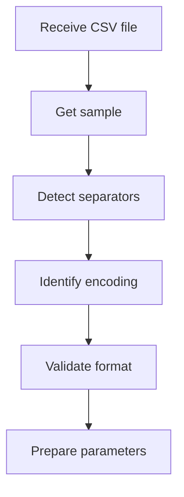
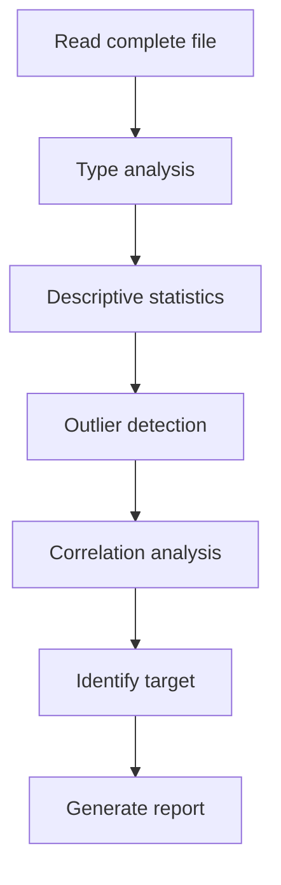

# DataProcessorAgent

## 🎯 Overview

The **DataProcessorAgent** is the first specialized agent in the Machine Learning pipeline and acts as the **data analysis expert**. Its main responsibility is to analyze, validate, and process datasets uploaded by users, providing detailed information about the structure, quality, and characteristics of the data.

## 🔧 Main Functionalities

### 📊 **Automatic Dataset Analysis**
- Automatic detection of column separators (`,`, `;`, `\t`, etc.)
- Identification of decimal separators (`.` vs `,`)
- Automatic encoding detection (UTF-8, Latin-1, etc.)
- CSV file integrity validation

### 🔍 **Structure Inspection**
- Analysis of data types per column
- Identification of numeric, categorical, and temporal columns
- Detection of null values and their distribution
- Identification of outliers and anomalous values

### 🎯 **Objective Identification**
- Automatic suggestion of target columns
- Classification of ML problem type (regression, classification, time series)
- Identification of relevant predictor variables

### 📈 **Statistical Analysis**
- Complete descriptive statistics
- Frequency distributions
- Variable correlations
- Temporal trend analysis (if applicable)

## 🛠️ Available Tools

The DataProcessorAgent uses two specialized tools in a two-step process:

### **1. get_sample_func**
**Purpose**: Initial file inspection
- Gets a small sample of the file (first lines)
- Allows format identification before complete processing
- Avoids reading errors due to incorrect parameters

**Usage**:
```python
# The agent calls internally:
sample = get_sample_func(file_path)
# Returns: First 5-10 lines of file as text
```

### **2. read_and_analyze_func**
**Purpose**: Complete dataset analysis
- Reads complete file with detected parameters
- Performs deep statistical analysis
- Generates complete data quality report

**Parameters**:
- `separator`: Detected column separator
- `decimal`: Identified decimal separator
- Other pandas parameters as needed

## 📋 Analysis Process

### **Step 1: Initial Inspection**


### **Step 2: Complete Analysis**


## 📊 Analysis Example

### **Input: Sales Dataset**
```csv
date,sales,month,day_of_week,promotion
2023-01-01,1234.56,1,6,0
2023-01-02,1345.78,1,0,1
2023-01-03,1156.90,1,1,0
...
```

### **Output: Analysis Report**
```json
{
  "file_info": {
    "filename": "sales.csv",
    "rows": 365,
    "columns": 5,
    "size_mb": 0.05,
    "encoding": "utf-8",
    "separator": ",",
    "decimal": "."
  },
  "column_analysis": {
    "date": {
      "type": "datetime",
      "null_count": 0,
      "unique_count": 365,
      "format": "YYYY-MM-DD"
    },
    "sales": {
      "type": "numeric",
      "null_count": 0,
      "min": 856.23,
      "max": 1567.89,
      "mean": 1234.45,
      "std": 123.67,
      "outliers": 3
    },
    "month": {
      "type": "categorical",
      "null_count": 0,
      "unique_values": [1,2,3,4,5,6,7,8,9,10,11,12],
      "mode": 6
    },
    "day_of_week": {
      "type": "categorical", 
      "null_count": 0,
      "unique_values": [0,1,2,3,4,5,6],
      "distribution": "uniform"
    },
    "promotion": {
      "type": "binary",
      "null_count": 0,
      "true_ratio": 0.2,
      "false_ratio": 0.8
    }
  },
  "ml_recommendations": {
    "problem_type": "time_series_regression",
    "target_column": "sales",
    "predictor_columns": ["month", "day_of_week", "promotion"],
    "temporal_column": "date",
    "suggested_algorithms": ["AutoML", "GBM", "RandomForest"]
  },
  "data_quality": {
    "completeness": 1.0,
    "consistency": 0.98,
    "accuracy": 0.95,
    "issues": [
      "3 outliers in 'sales' column",
      "Consider feature engineering for temporal patterns"
    ],
    "recommendations": [
      "Data is ready for ML training",
      "Consider adding lag features for time series",
      "Outliers may need investigation"
    ]
  }
}
```

## 🎯 Agent Configuration

### **System Prompt**
The DataProcessorAgent uses a specialized prompt that instructs it on:
- Two-step analysis process
- Data analysis best practices
- Common problem identification
- Structured report generation

### **Language Model**
- **Model**: gpt-oss:120b (via Ollama or Hugging Face)
- **Temperature**: 0.1 (deterministic responses)
- **Max Tokens**: 4000 (for detailed analysis)

## 🔄 Integration with Other Agents

### **Communication Flow**


### **Shared Data**
- **To ModelBuilderAgent**: Problem type, target columns, data types
- **To UserProxyAgent**: Analysis status, found problems
- **To AnalystAgent**: Data quality metrics

## 🐛 Error Handling

### **Common Errors and Solutions**

#### **Error: File not found**
```python
# Internal agent error handling
if not os.path.exists(file_path):
    return {
        "error": "File not found",
        "message": "Please verify the file path",
        "suggestions": ["Check file exists", "Verify permissions"]
    }
```

#### **Error: Unrecognized format**
```python
# Multiple reading attempts
separators = [',', ';', '\t', '|']
for sep in separators:
    try:
        df = pd.read_csv(file_path, sep=sep, nrows=5)
        if len(df.columns) > 1:
            detected_separator = sep
            break
    except:
        continue
```

#### **Error: Incorrect encoding**
```python
# Automatic encoding detection
encodings = ['utf-8', 'latin-1', 'cp1252', 'iso-8859-1']
for encoding in encodings:
    try:
        with open(file_path, 'r', encoding=encoding) as f:
            sample = f.read(1000)
        detected_encoding = encoding
        break
    except UnicodeDecodeError:
        continue
```

## 📊 Metrics and Monitoring

### **Performance Metrics**
- **Analysis time**: Typically 30-60 seconds
- **Detection accuracy**: >95% for standard formats
- **Type coverage**: Numeric, categorical, temporal, text

### **Activity Logs**
```json
{
  "timestamp": "2024-01-01T10:30:00Z",
  "agent": "DataProcessorAgent",
  "pipeline_id": "pipeline_123",
  "action": "analyze_dataset",
  "file_info": {
    "name": "sales.csv",
    "size": "1.2MB",
    "rows": 10000
  },
  "execution_time": 45.2,
  "status": "completed",
  "issues_found": 2
}
```

## 🔧 Customization and Extension

### **Add New Data Types**
```python
# Extend type detection
def detect_custom_types(column):
    if column.name.endswith('_id'):
        return 'identifier'
    elif 'email' in column.name.lower():
        return 'email'
    elif 'phone' in column.name.lower():
        return 'phone'
    # ... more custom detections
```

### **Configure Thresholds**
```python
# Customizable configuration
ANALYSIS_CONFIG = {
    "outlier_threshold": 3.0,  # Standard deviations
    "null_warning_threshold": 0.05,  # 5% null values
    "correlation_threshold": 0.7,  # High correlation
    "sample_size": 1000  # Rows for initial analysis
}
```

## 📚 Best Practices

### **For Developers**
1. **Validate input**: Always verify format before complete analysis
2. **Robust handling**: Implement fallbacks for non-standard formats
3. **Performance**: Use sampling for large datasets
4. **Logging**: Record all steps for debugging

### **For Users**
1. **Consistent format**: Use standard separators (comma)
2. **Encoding**: Prefer UTF-8 when possible
3. **Headers**: Include descriptive column names
4. **Quality**: Minimize null values and inconsistencies

## 🔍 Troubleshooting

### **Problem: Very slow analysis**
```python
# Solution: Configure sampling
SAMPLE_CONFIG = {
    "max_rows": 10000,  # Limit rows for analysis
    "sample_ratio": 0.1  # Use 10% of dataset if too large
}
```

### **Problem: Incorrect type detection**
```python
# Solution: Manual type configuration
TYPE_HINTS = {
    'id': 'string',
    'date': 'datetime',
    'category': 'categorical'
}
```

---

The **DataProcessorAgent** is fundamental for pipeline success, as the quality of initial analysis determines the effectiveness of all subsequent steps.

**Next**: [ModelBuilderAgent](model_builder_agent.md)