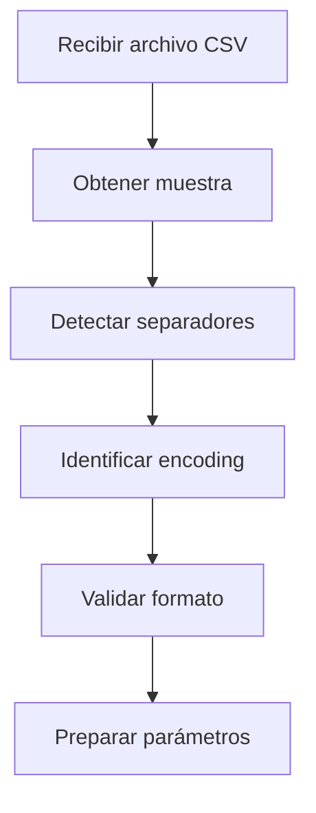
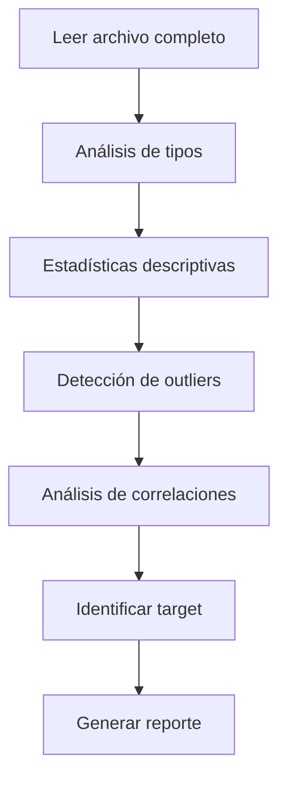
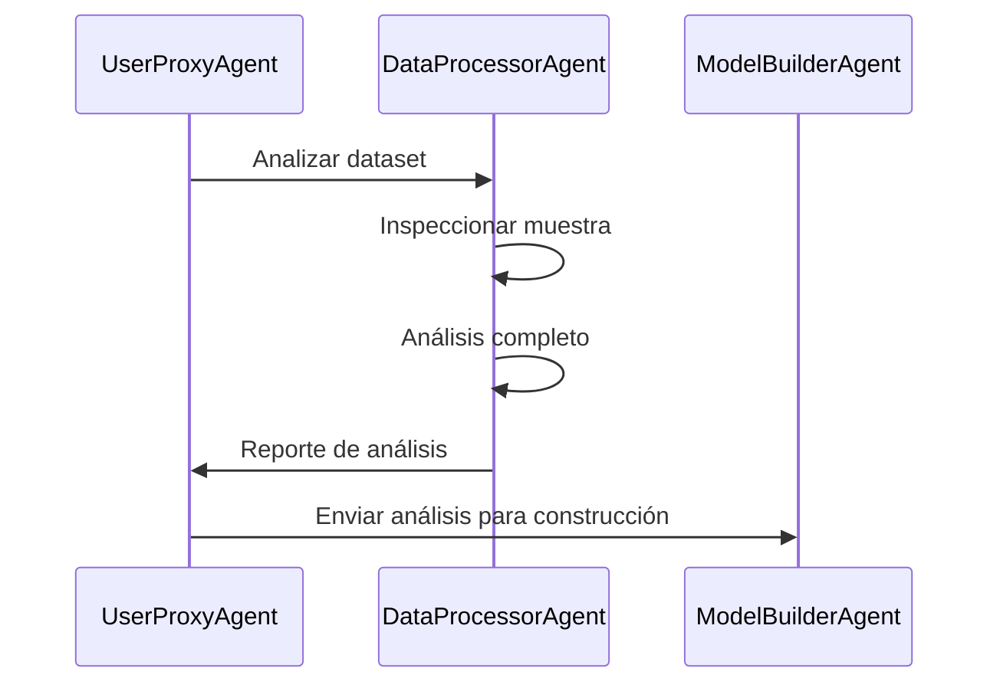

# DataProcessorAgent

## 🎯 Descripción General

El **DataProcessorAgent** es el primer agente especializado en el pipeline de Machine Learning y actúa como el **experto en análisis de datos**. Su responsabilidad principal es analizar, validar y procesar datasets cargados por usuarios, proporcionando información detallada sobre la estructura, calidad y características de los datos.

## 🔧 Funcionalidades Principales

### 📊 **Análisis Automático de Datasets**
- Detección automática de separadores de columnas (`,`, `;`, `\t`, etc.)
- Identificación de separadores decimales (`.` vs `,`)
- Detección automática de encoding (UTF-8, Latin-1, etc.)
- Validación de integridad del archivo CSV

### 🔍 **Inspección de Estructura**
- Análisis de tipos de datos por columna
- Identificación de columnas numéricas, categóricas y temporales
- Detección de valores nulos y su distribución
- Identificación de outliers y valores anómalos

### 🎯 **Identificación de Objetivos**
- Sugerencia automática de columnas objetivo (target)
- Clasificación del tipo de problema ML (regresión, clasificación, series temporales)
- Identificación de variables predictoras relevantes

### 📈 **Análisis Estadístico**
- Estadísticas descriptivas completas
- Distribuciones de frecuencia
- Correlaciones entre variables
- Análisis de tendencias temporales (si aplica)

## 🛠️ Herramientas Disponibles

El DataProcessorAgent utiliza dos herramientas especializadas en un proceso de dos pasos:

### **1. get_sample_func**
**Propósito**: Inspección inicial del archivo
- Obtiene una muestra pequeña del archivo (primeras líneas)
- Permite identificar formato antes de procesamiento completo
- Evita errores de lectura por parámetros incorrectos

**Uso**:
```python
# El agente llama internamente:
sample = get_sample_func(file_path)
# Retorna: Primeras 5-10 líneas del archivo como texto
```

### **2. read_and_analyze_func**
**Propósito**: Análisis completo del dataset
- Lee el archivo completo con parámetros detectados
- Realiza análisis estadístico profundo
- Genera reporte completo de calidad de datos

**Parámetros**:
- `separator`: Separador de columnas detectado
- `decimal`: Separador decimal identificado
- Otros parámetros de pandas según necesidad

## 📋 Proceso de Análisis

### **Paso 1: Inspección Inicial**


### **Paso 2: Análisis Completo**


## 📊 Ejemplo de Análisis

### **Input: Dataset de Ventas**
```csv
fecha,ventas,mes,dia_semana,promocion
2023-01-01,1234.56,1,6,0
2023-01-02,1345.78,1,0,1
2023-01-03,1156.90,1,1,0
...
```

### **Output: Reporte de Análisis**
```json
{
  "file_info": {
    "filename": "ventas.csv",
    "rows": 365,
    "columns": 5,
    "size_mb": 0.05,
    "encoding": "utf-8",
    "separator": ",",
    "decimal": "."
  },
  "column_analysis": {
    "fecha": {
      "type": "datetime",
      "null_count": 0,
      "unique_count": 365,
      "format": "YYYY-MM-DD"
    },
    "ventas": {
      "type": "numeric",
      "null_count": 0,
      "min": 856.23,
      "max": 1567.89,
      "mean": 1234.45,
      "std": 123.67,
      "outliers": 3
    },
    "mes": {
      "type": "categorical",
      "null_count": 0,
      "unique_values": [1,2,3,4,5,6,7,8,9,10,11,12],
      "mode": 6
    },
    "dia_semana": {
      "type": "categorical", 
      "null_count": 0,
      "unique_values": [0,1,2,3,4,5,6],
      "distribution": "uniform"
    },
    "promocion": {
      "type": "binary",
      "null_count": 0,
      "true_ratio": 0.2,
      "false_ratio": 0.8
    }
  },
  "ml_recommendations": {
    "problem_type": "time_series_regression",
    "target_column": "ventas",
    "predictor_columns": ["mes", "dia_semana", "promocion"],
    "temporal_column": "fecha",
    "suggested_algorithms": ["AutoML", "GBM", "RandomForest"]
  },
  "data_quality": {
    "completeness": 1.0,
    "consistency": 0.98,
    "accuracy": 0.95,
    "issues": [
      "3 outliers in 'ventas' column",
      "Consider feature engineering for temporal patterns"
    ],
    "recommendations": [
      "Data is ready for ML training",
      "Consider adding lag features for time series",
      "Outliers may need investigation"
    ]
  }
}
```

## 🎯 Configuración del Agente

### **Prompt del Sistema**
El DataProcessorAgent utiliza un prompt especializado que le instruye sobre:
- Proceso de análisis en dos pasos
- Mejores prácticas de análisis de datos
- Identificación de problemas comunes
- Generación de reportes estructurados

### **Modelo de Lenguaje**
- **Modelo**: gpt-oss:120b (via Ollama o Hugging Face)
- **Temperatura**: 0.1 (respuestas determinísticas)
- **Max Tokens**: 4000 (para análisis detallados)

## 🔄 Integración con Otros Agentes

### **Flujo de Comunicación**


### **Datos Compartidos**
- **A ModelBuilderAgent**: Tipo de problema, columnas objetivo, tipos de datos
- **A UserProxyAgent**: Estado del análisis, problemas encontrados
- **A AnalystAgent**: Métricas de calidad de datos

## 🐛 Manejo de Errores

### **Errores Comunes y Soluciones**

#### **Error: Archivo no encontrado**
```python
# Error handling interno del agente
if not os.path.exists(file_path):
    return {
        "error": "File not found",
        "message": "Please verify the file path",
        "suggestions": ["Check file exists", "Verify permissions"]
    }
```

#### **Error: Formato no reconocido**
```python
# Intentos múltiples de lectura
separators = [',', ';', '\t', '|']
for sep in separators:
    try:
        df = pd.read_csv(file_path, sep=sep, nrows=5)
        if len(df.columns) > 1:
            detected_separator = sep
            break
    except:
        continue
```

#### **Error: Encoding incorrecto**
```python
# Detección automática de encoding
encodings = ['utf-8', 'latin-1', 'cp1252', 'iso-8859-1']
for encoding in encodings:
    try:
        with open(file_path, 'r', encoding=encoding) as f:
            sample = f.read(1000)
        detected_encoding = encoding
        break
    except UnicodeDecodeError:
        continue
```

## 📊 Métricas y Monitoreo

### **Métricas de Rendimiento**
- **Tiempo de análisis**: Típicamente 30-60 segundos
- **Precisión de detección**: >95% para formatos estándar
- **Cobertura de tipos**: Numérico, categórico, temporal, texto

### **Logs de Actividad**
```json
{
  "timestamp": "2024-01-01T10:30:00Z",
  "agent": "DataProcessorAgent",
  "pipeline_id": "pipeline_123",
  "action": "analyze_dataset",
  "file_info": {
    "name": "sales.csv",
    "size": "1.2MB",
    "rows": 10000
  },
  "execution_time": 45.2,
  "status": "completed",
  "issues_found": 2
}
```

## 🔧 Personalización y Extensión

### **Añadir Nuevos Tipos de Datos**
```python
# Extender detección de tipos
def detect_custom_types(column):
    if column.name.endswith('_id'):
        return 'identifier'
    elif 'email' in column.name.lower():
        return 'email'
    elif 'phone' in column.name.lower():
        return 'phone'
    # ... más detecciones personalizadas
```

### **Configurar Umbrales**
```python
# Configuración personalizable
ANALYSIS_CONFIG = {
    "outlier_threshold": 3.0,  # Desviaciones estándar
    "null_warning_threshold": 0.05,  # 5% valores nulos
    "correlation_threshold": 0.7,  # Correlación alta
    "sample_size": 1000  # Filas para análisis inicial
}
```

## 📚 Best Practices

### **Para Desarrolladores**
1. **Validar entrada**: Siempre verificar formato antes de análisis completo
2. **Manejo robusto**: Implementar fallbacks para formatos no estándar
3. **Performance**: Usar muestreo para datasets grandes
4. **Logging**: Registrar todos los pasos para debugging

### **Para Usuarios**
1. **Formato consistente**: Usar separadores estándar (coma)
2. **Encoding**: Preferir UTF-8 cuando sea posible
3. **Headers**: Incluir nombres de columna descriptivos
4. **Calidad**: Minimizar valores nulos y inconsistencias

## 🔍 Troubleshooting

### **Problema: Análisis muy lento**
```python
# Solución: Configurar muestreo
SAMPLE_CONFIG = {
    "max_rows": 10000,  # Limitar filas para análisis
    "sample_ratio": 0.1  # Usar 10% del dataset si es muy grande
}
```

### **Problema: Detección incorrecta de tipos**
```python
# Solución: Configuración manual de tipos
TYPE_HINTS = {
    'id': 'string',
    'fecha': 'datetime',
    'categoria': 'categorical'
}
```

---

El **DataProcessorAgent** es fundamental para el éxito del pipeline, ya que la calidad del análisis inicial determina la efectividad de todos los pasos posteriores.

**Siguiente**: [ModelBuilderAgent](model_builder_agent.md)