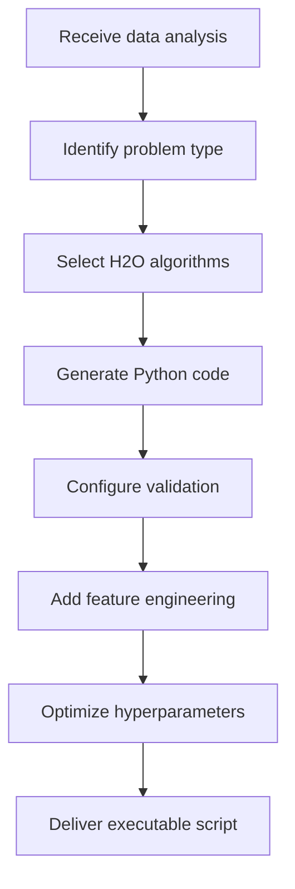

# ModelBuilderAgent

## 🎯 Overview

The **ModelBuilderAgent** is the **Machine Learning model architect** of the system. Its main responsibility is to transform the data analysis provided by the DataProcessorAgent into **executable Python code** that uses H2O AutoML to train optimal ML models.

## 🧠 Main Functionalities

### 🐍 **Automatic Python Code Generation**
- Creates complete model training scripts
- Implements Machine Learning best practices
- Automatically integrates with H2O AutoML
- Optimizes hyperparameters according to problem type

### 🎯 **Specialization by Problem Type**
- **Regression**: For continuous value prediction
- **Classification**: For category prediction
- **Time Series**: For forecasting and trends
- **Clustering**: For unsupervised segmentation

### 🔧 **Automatic H2O Configuration**
- Optimized H2O cluster initialization
- Memory and resource configuration
- Automatic algorithm selection
- Cross-validation parameters

### 📊 **Intelligent Feature Engineering**
- Automatic categorical variable transformation
- Null value handling
- Numeric variable scaling
- Temporal feature creation

## 🏗️ Agent Architecture

### **Base Configuration**
```python
# agents/model_builder_agent.py
def create_model_builder_agent():
    model_client = create_model_client()
    
    return AssistantAgent(
        name="ModelBuilderAgent",
        model_client=model_client,
        description="Machine Learning expert that generates Python scripts for H2O AutoML",
        system_message=MODEL_BUILDER_PROMPT,
    )
```

### **System Prompt**
The ModelBuilderAgent uses a specialized prompt that includes:
- H2O AutoML best practices
- Code patterns for different ML types
- Error handling and validation
- Performance optimization

## 🔄 Model Building Process

### **Workflow**


### **Types of Generated Code**

#### **1. Regression - Sales Prediction**
```python
import h2o
from h2o.automl import H2OAutoML
import pandas as pd
from datetime import datetime

# Initialize H2O
h2o.init(max_mem_size="4G", nthreads=-1)

# Load and prepare data
df = pd.read_csv('/path/to/sales.csv')
h2o_df = h2o.H2OFrame(df)

# Configure variables
y = 'sales'
x = h2o_df.columns
x.remove(y)

# Split data
train, valid, test = h2o_df.split_frame([0.7, 0.15], seed=42)

# Configure H2O AutoML for regression
aml = H2OAutoML(
    max_models=20,
    max_runtime_secs=1800,
    nfolds=5,
    seed=42,
    sort_metric='RMSE',
    verbosity='info'
)

# Train models
aml.train(x=x, y=y, training_frame=train, validation_frame=valid)

# Evaluate model
perf = aml.leader.model_performance(test)
print(f"Test RMSE: {perf.rmse()}")
print(f"Test MAE: {perf.mae()}")
print(f"Test R²: {perf.r2()}")

# Save model
model_path = h2o.save_model(aml.leader, path="./models", force=True)
print(f"Model saved at: {model_path}")

# Feature importance
importance = aml.leader.varimp(use_pandas=True)
print("Feature importance:")
print(importance)

h2o.cluster().shutdown()
```

#### **2. Classification - Customer Segmentation**
```python
import h2o
from h2o.automl import H2OAutoML
import pandas as pd

# Initialize H2O
h2o.init()

# Load data
df = pd.read_csv('/path/to/customers.csv')
h2o_df = h2o.H2OFrame(df)

# Convert target variable to categorical
h2o_df['segment'] = h2o_df['segment'].asfactor()

# Configure variables
y = 'segment'
x = h2o_df.columns
x.remove(y)

# Split data
train, valid, test = h2o_df.split_frame([0.7, 0.15], seed=42)

# AutoML for classification
aml = H2OAutoML(
    max_models=15,
    max_runtime_secs=1200,
    balance_classes=True,
    nfolds=5,
    seed=42,
    sort_metric='AUC'
)

# Train
aml.train(x=x, y=y, training_frame=train, validation_frame=valid)

# Classification metrics
perf = aml.leader.model_performance(test)
print(f"AUC: {perf.auc()[0][1]}")
print(f"Accuracy: {perf.accuracy()[0][1]}")
print(f"Log Loss: {perf.logloss()}")

# Confusion matrix
print("Confusion matrix:")
print(perf.confusion_matrix())

# Save model
h2o.save_model(aml.leader, path="./models", force=True)
h2o.cluster().shutdown()
```

#### **3. Time Series - Demand Forecasting**
```python
import h2o
from h2o.automl import H2OAutoML
import pandas as pd
from datetime import datetime, timedelta

# Initialize H2O
h2o.init()

# Load and process temporal data
df = pd.read_csv('/path/to/demand.csv')
df['date'] = pd.to_datetime(df['date'])
df = df.sort_values('date')

# Temporal feature engineering
df['year'] = df['date'].dt.year
df['month'] = df['date'].dt.month
df['day_of_week'] = df['date'].dt.dayofweek
df['day_of_year'] = df['date'].dt.dayofyear

# Create lags for time series
for lag in [1, 7, 30]:
    df[f'demand_lag_{lag}'] = df['demand'].shift(lag)

# Remove NaNs created by lags
df = df.dropna()

# Convert to H2O
h2o_df = h2o.H2OFrame(df)

# Predictor variables (without original date)
y = 'demand'
x = [col for col in h2o_df.columns if col not in ['date', 'demand']]

# Temporal split (last 20% for test)
n_rows = h2o_df.nrows
split_point = int(n_rows * 0.8)
train = h2o_df[:split_point, :]
test = h2o_df[split_point:, :]

# AutoML specialized in time series
aml = H2OAutoML(
    max_models=25,
    max_runtime_secs=2400,
    nfolds=3,  # Less folds for time series
    seed=42,
    sort_metric='RMSE'
)

# Train
aml.train(x=x, y=y, training_frame=train)

# Evaluate on test (temporal validation)
predictions = aml.leader.predict(test)
perf = aml.leader.model_performance(test)

print(f"Temporal RMSE: {perf.rmse()}")
print(f"Temporal MAE: {perf.mae()}")

# Save model and predictions
h2o.save_model(aml.leader, path="./models", force=True)
predictions.as_data_frame().to_csv('./results/temporal_predictions.csv', index=False)

h2o.cluster().shutdown()
```

## 🎯 Domain Specialization

### **E-commerce and Retail**
```python
# Retail-specific feature engineering
df['is_weekend'] = df['day_of_week'].isin([5, 6]).astype(int)
df['is_high_season'] = df['month'].isin([11, 12]).astype(int)
df['relative_price'] = df['price'] / df.groupby('category')['price'].transform('mean')
```

### **Finance**
```python
# Financial features
df['volatility'] = df['price'].rolling(30).std()
df['rsi'] = calculate_rsi(df['price'], 14)
df['moving_average_20'] = df['price'].rolling(20).mean()
```

### **IoT and Sensors**
```python
# Sensor data processing
df['temp_smoothed'] = df['temperature'].rolling(5).mean()
df['temp_anomaly'] = (abs(df['temperature'] - df['temp_smoothed']) > 2 * df['temperature'].std()).astype(int)
```

## 🔧 Advanced Configuration

### **Hyperparameter Optimization**
```python
# Adaptive configuration based on data size
def configure_automl(data_size):
    if data_size < 1000:
        return H2OAutoML(max_models=5, max_runtime_secs=300)
    elif data_size < 50000:
        return H2OAutoML(max_models=15, max_runtime_secs=1200)
    else:
        return H2OAutoML(max_models=30, max_runtime_secs=3600)
```

### **Algorithm Selection**
```python
# Algorithms by problem type
ALGORITHM_CONFIG = {
    'regression': ['GBM', 'XGBoost', 'RandomForest', 'GLM'],
    'classification': ['GBM', 'XGBoost', 'RandomForest', 'DeepLearning'],
    'time_series': ['GBM', 'XGBoost', 'GLM'],
    'clustering': ['KMeans', 'IsolationForest']
}
```

## 📊 Validation and Metrics

### **Metrics by Problem Type**

#### **Regression**
- **RMSE**: Root mean square error
- **MAE**: Mean absolute error  
- **R²**: Coefficient of determination
- **MAPE**: Mean absolute percentage error

#### **Classification**
- **AUC**: Area under ROC curve
- **Accuracy**: Overall accuracy
- **Precision/Recall**: Per class
- **F1-Score**: Harmonic mean of precision and recall

#### **Time Series**
- **MASE**: Mean absolute scaled error
- **sMAPE**: Symmetric mean absolute percentage error
- **Directional Accuracy**: Directional accuracy

### **Robust Validation**
```python
# Cross-validation configuration
VALIDATION_CONFIG = {
    'regression': {'nfolds': 5, 'fold_assignment': 'Random'},
    'classification': {'nfolds': 5, 'balance_classes': True},
    'time_series': {'nfolds': 3, 'fold_assignment': 'Modulo'}
}
```

## 🔄 Integration with Other Agents

### **Input from DataProcessorAgent**
```json
{
  "problem_type": "time_series_regression",
  "target_column": "sales",
  "predictor_columns": ["month", "day_of_week", "promotion"],
  "temporal_column": "date",
  "data_quality": {
    "completeness": 0.98,
    "outliers": 3
  }
}
```

### **Output to CodeExecutorAgent**
```python
# Complete and executable Python script
generated_script = """
# Code generated by ModelBuilderAgent
import h2o
from h2o.automl import H2OAutoML
# ... rest of code
"""
```

### **Communication with AnalystAgent**
```json
{
  "script_generated": true,
  "algorithms_selected": ["GBM", "XGBoost", "RandomForest"],
  "validation_strategy": "time_series_split",
  "expected_metrics": ["RMSE", "MAE", "R2"]
}
```

## 🐛 Error Handling

### **Common Errors and Solutions**

#### **Insufficient Memory**
```python
# Adaptive memory configuration
try:
    h2o.init(max_mem_size="8G")
except:
    h2o.init(max_mem_size="4G")
    print("Warning: Limited memory, reducing models")
```

#### **Unbalanced Data**
```python
# Automatic balancing for classification
if problem_type == 'classification':
    class_distribution = df[target].value_counts()
    if class_distribution.min() / class_distribution.max() < 0.1:
        balance_classes = True
        class_sampling_factors = calculate_sampling_factors(class_distribution)
```

#### **Correlated Features**
```python
# Automatic multicollinearity removal
correlation_matrix = df.corr()
highly_correlated = find_highly_correlated_features(correlation_matrix, 0.95)
if highly_correlated:
    print(f"Removing correlated features: {highly_correlated}")
    df = df.drop(columns=highly_correlated)
```

## 📈 Performance Optimization

### **Parallelization**
```python
# Thread configuration based on hardware
import multiprocessing
optimal_threads = min(multiprocessing.cpu_count(), 8)
h2o.init(nthreads=optimal_threads)
```

### **Memory Management**
```python
# Proactive memory release
def cleanup_h2o():
    h2o.remove_all()
    h2o.cluster().shutdown()
    h2o.init()
```

### **Early Stopping**
```python
# Early stopping for efficiency
aml = H2OAutoML(
    max_models=20,
    max_runtime_secs=1800,
    stopping_rounds=3,
    stopping_tolerance=0.001
)
```

## 📚 Best Practices

### **For Code Generation**
1. **Reproducibility**: Always use fixed seeds
2. **Validation**: Implement appropriate splits by problem type  
3. **Cleanup**: Include resource release
4. **Logging**: Record important steps and metrics

### **For Optimization**
1. **Adaptive configuration**: Adjust based on data size
2. **Algorithm selection**: Specialize by domain
3. **Feature engineering**: Automatic but contextual
4. **Cross-validation**: Appropriate for data type

## 🔍 Troubleshooting

### **Problem: H2O doesn't start**
```bash
# Check available ports
netstat -tulpn | grep 54321

# Clean previous H2O processes
pkill -f h2o
```

### **Problem: Low quality models**
```python
# Increase training time
H2OAutoML(max_runtime_secs=3600, max_models=50)

# Improve feature engineering
include_interaction_terms=True
```

### **Problem: Memory leak**
```python
# Explicit cleanup after each model
h2o.remove_all()
gc.collect()
```

---

The **ModelBuilderAgent** is the intelligent heart of the system, transforming data analysis into executable and optimized ML code.

**Next**: [CodeExecutorAgent](code_executor_agent.md)