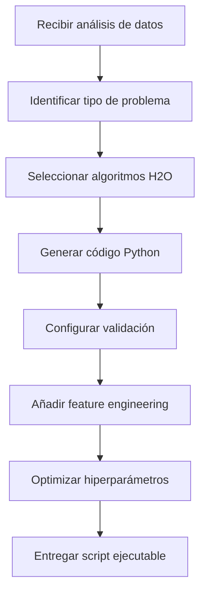

# ModelBuilderAgent

## 🎯 Descripción General

El **ModelBuilderAgent** es el **arquitecto de modelos de Machine Learning** del sistema. Su responsabilidad principal es transformar el análisis de datos proporcionado por el DataProcessorAgent en **código Python ejecutable** que utiliza H2O AutoML para entrenar modelos de ML óptimos.

## 🧠 Funcionalidades Principales

### 🐍 **Generación Automática de Código Python**
- Crea scripts completos de entrenamiento de modelos
- Implementa mejores prácticas de Machine Learning
- Integra automáticamente con H2O AutoML
- Optimiza hiperparámetros según el tipo de problema

### 🎯 **Especialización por Tipo de Problema**
- **Regresión**: Para predicción de valores continuos
- **Clasificación**: Para predicción de categorías
- **Series Temporales**: Para pronósticos y tendencias
- **Clustering**: Para segmentación no supervisada

### 🔧 **Configuración Automática de H2O**
- Inicialización optimizada de H2O cluster
- Configuración de memoria y recursos
- Selección automática de algoritmos
- Parámetros de validación cruzada

### 📊 **Feature Engineering Inteligente**
- Transformación automática de variables categóricas
- Manejo de valores nulos
- Escalado de variables numéricas
- Creación de características temporales

## 🏗️ Arquitectura del Agente

### **Configuración Base**
```python
# agents/model_builder_agent.py
def create_model_builder_agent():
    model_client = create_model_client()
    
    return AssistantAgent(
        name="ModelBuilderAgent",
        model_client=model_client,
        description="Machine Learning expert that generates Python scripts for H2O AutoML",
        system_message=MODEL_BUILDER_PROMPT,
    )
```

### **Prompt del Sistema**
El ModelBuilderAgent utiliza un prompt especializado que incluye:
- Mejores prácticas de H2O AutoML
- Patrones de código para diferentes tipos de ML
- Manejo de errores y validación
- Optimización de rendimiento

## 🔄 Proceso de Construcción de Modelos

### **Flujo de Trabajo**


### **Tipos de Código Generado**

#### **1. Regresión - Predicción de Ventas**
```python
import h2o
from h2o.automl import H2OAutoML
import pandas as pd
from datetime import datetime

# Inicializar H2O
h2o.init(max_mem_size="4G", nthreads=-1)

# Cargar y preparar datos
df = pd.read_csv('/path/to/ventas.csv')
h2o_df = h2o.H2OFrame(df)

# Configurar variables
y = 'ventas'
x = h2o_df.columns
x.remove(y)

# Dividir datos
train, valid, test = h2o_df.split_frame([0.7, 0.15], seed=42)

# Configurar H2O AutoML para regresión
aml = H2OAutoML(
    max_models=20,
    max_runtime_secs=1800,
    nfolds=5,
    seed=42,
    sort_metric='RMSE',
    verbosity='info'
)

# Entrenar modelos
aml.train(x=x, y=y, training_frame=train, validation_frame=valid)

# Evaluar modelo
perf = aml.leader.model_performance(test)
print(f"RMSE en test: {perf.rmse()}")
print(f"MAE en test: {perf.mae()}")
print(f"R² en test: {perf.r2()}")

# Guardar modelo
model_path = h2o.save_model(aml.leader, path="./models", force=True)
print(f"Modelo guardado en: {model_path}")

# Importancia de características
importance = aml.leader.varimp(use_pandas=True)
print("Importancia de características:")
print(importance)

h2o.cluster().shutdown()
```

#### **2. Clasificación - Segmentación de Clientes**
```python
import h2o
from h2o.automl import H2OAutoML
import pandas as pd

# Inicializar H2O
h2o.init()

# Cargar datos
df = pd.read_csv('/path/to/clientes.csv')
h2o_df = h2o.H2OFrame(df)

# Convertir variable objetivo a categórica
h2o_df['segmento'] = h2o_df['segmento'].asfactor()

# Configurar variables
y = 'segmento'
x = h2o_df.columns
x.remove(y)

# Dividir datos
train, valid, test = h2o_df.split_frame([0.7, 0.15], seed=42)

# AutoML para clasificación
aml = H2OAutoML(
    max_models=15,
    max_runtime_secs=1200,
    balance_classes=True,
    nfolds=5,
    seed=42,
    sort_metric='AUC'
)

# Entrenar
aml.train(x=x, y=y, training_frame=train, validation_frame=valid)

# Métricas de clasificación
perf = aml.leader.model_performance(test)
print(f"AUC: {perf.auc()[0][1]}")
print(f"Accuracy: {perf.accuracy()[0][1]}")
print(f"Log Loss: {perf.logloss()}")

# Matriz de confusión
print("Matriz de confusión:")
print(perf.confusion_matrix())

# Guardar modelo
h2o.save_model(aml.leader, path="./models", force=True)
h2o.cluster().shutdown()
```

#### **3. Series Temporales - Pronóstico de Demanda**
```python
import h2o
from h2o.automl import H2OAutoML
import pandas as pd
from datetime import datetime, timedelta

# Inicializar H2O
h2o.init()

# Cargar y procesar datos temporales
df = pd.read_csv('/path/to/demanda.csv')
df['fecha'] = pd.to_datetime(df['fecha'])
df = df.sort_values('fecha')

# Feature engineering temporal
df['año'] = df['fecha'].dt.year
df['mes'] = df['fecha'].dt.month
df['dia_semana'] = df['fecha'].dt.dayofweek
df['dia_año'] = df['fecha'].dt.dayofyear

# Crear lags para series temporales
for lag in [1, 7, 30]:
    df[f'demanda_lag_{lag}'] = df['demanda'].shift(lag)

# Eliminar NaNs creados por lags
df = df.dropna()

# Convertir a H2O
h2o_df = h2o.H2OFrame(df)

# Variables predictoras (sin fecha original)
y = 'demanda'
x = [col for col in h2o_df.columns if col not in ['fecha', 'demanda']]

# Split temporal (últimos 20% para test)
n_rows = h2o_df.nrows
split_point = int(n_rows * 0.8)
train = h2o_df[:split_point, :]
test = h2o_df[split_point:, :]

# AutoML especializado en series temporales
aml = H2OAutoML(
    max_models=25,
    max_runtime_secs=2400,
    nfolds=3,  # Menos folds para series temporales
    seed=42,
    sort_metric='RMSE'
)

# Entrenar
aml.train(x=x, y=y, training_frame=train)

# Evaluar en test (validación temporal)
predictions = aml.leader.predict(test)
perf = aml.leader.model_performance(test)

print(f"RMSE temporal: {perf.rmse()}")
print(f"MAE temporal: {perf.mae()}")

# Guardar modelo y predicciones
h2o.save_model(aml.leader, path="./models", force=True)
predictions.as_data_frame().to_csv('./results/predicciones_temporales.csv', index=False)

h2o.cluster().shutdown()
```

## 🎯 Especialización por Dominio

### **E-commerce y Retail**
```python
# Feature engineering específico para retail
df['es_fin_semana'] = df['dia_semana'].isin([5, 6]).astype(int)
df['es_temporada_alta'] = df['mes'].isin([11, 12]).astype(int)
df['precio_relativo'] = df['precio'] / df.groupby('categoria')['precio'].transform('mean')
```

### **Finanzas**
```python
# Características financieras
df['volatilidad'] = df['precio'].rolling(30).std()
df['rsi'] = calculate_rsi(df['precio'], 14)
df['media_movil_20'] = df['precio'].rolling(20).mean()
```

### **IoT y Sensores**
```python
# Procesamiento de datos de sensores
df['temp_suavizada'] = df['temperatura'].rolling(5).mean()
df['anomalia_temp'] = (abs(df['temperatura'] - df['temp_suavizada']) > 2 * df['temperatura'].std()).astype(int)
```

## 🔧 Configuración Avanzada

### **Optimización de Hiperparámetros**
```python
# Configuración adaptativa según tamaño de datos
def configure_automl(data_size):
    if data_size < 1000:
        return H2OAutoML(max_models=5, max_runtime_secs=300)
    elif data_size < 50000:
        return H2OAutoML(max_models=15, max_runtime_secs=1200)
    else:
        return H2OAutoML(max_models=30, max_runtime_secs=3600)
```

### **Selección de Algoritmos**
```python
# Algoritmos por tipo de problema
ALGORITHM_CONFIG = {
    'regression': ['GBM', 'XGBoost', 'RandomForest', 'GLM'],
    'classification': ['GBM', 'XGBoost', 'RandomForest', 'DeepLearning'],
    'time_series': ['GBM', 'XGBoost', 'GLM'],
    'clustering': ['KMeans', 'IsolationForest']
}
```

## 📊 Validación y Métricas

### **Métricas por Tipo de Problema**

#### **Regresión**
- **RMSE**: Error cuadrático medio
- **MAE**: Error absoluto medio  
- **R²**: Coeficiente de determinación
- **MAPE**: Error porcentual absoluto medio

#### **Clasificación**
- **AUC**: Área bajo la curva ROC
- **Accuracy**: Precisión general
- **Precision/Recall**: Por clase
- **F1-Score**: Media armónica de precisión y recall

#### **Series Temporales**
- **MASE**: Error escalado absoluto medio
- **sMAPE**: Error porcentual absoluto simétrico
- **Directional Accuracy**: Precisión direccional

### **Validación Robusta**
```python
# Configuración de validación cruzada
VALIDATION_CONFIG = {
    'regression': {'nfolds': 5, 'fold_assignment': 'Random'},
    'classification': {'nfolds': 5, 'balance_classes': True},
    'time_series': {'nfolds': 3, 'fold_assignment': 'Modulo'}
}
```

## 🔄 Integración con Otros Agentes

### **Input desde DataProcessorAgent**
```json
{
  "problem_type": "time_series_regression",
  "target_column": "ventas",
  "predictor_columns": ["mes", "dia_semana", "promocion"],
  "temporal_column": "fecha",
  "data_quality": {
    "completeness": 0.98,
    "outliers": 3
  }
}
```

### **Output hacia CodeExecutorAgent**
```python
# Script Python completo y ejecutable
generated_script = """
# Código generado por ModelBuilderAgent
import h2o
from h2o.automl import H2OAutoML
# ... resto del código
"""
```

### **Comunicación con AnalystAgent**
```json
{
  "script_generated": true,
  "algorithms_selected": ["GBM", "XGBoost", "RandomForest"],
  "validation_strategy": "time_series_split",
  "expected_metrics": ["RMSE", "MAE", "R2"]
}
```

## 🐛 Manejo de Errores

### **Errores Comunes y Soluciones**

#### **Memoria Insuficiente**
```python
# Configuración adaptativa de memoria
try:
    h2o.init(max_mem_size="8G")
except:
    h2o.init(max_mem_size="4G")
    print("Advertencia: Memoria limitada, reduciendo modelos")
```

#### **Datos Desbalanceados**
```python
# Balanceo automático para clasificación
if problem_type == 'classification':
    class_distribution = df[target].value_counts()
    if class_distribution.min() / class_distribution.max() < 0.1:
        balance_classes = True
        class_sampling_factors = calculate_sampling_factors(class_distribution)
```

#### **Features Correlacionadas**
```python
# Eliminación automática de multicolinealidad
correlation_matrix = df.corr()
highly_correlated = find_highly_correlated_features(correlation_matrix, 0.95)
if highly_correlated:
    print(f"Eliminando features correlacionadas: {highly_correlated}")
    df = df.drop(columns=highly_correlated)
```

## 📈 Optimización de Rendimiento

### **Paralelización**
```python
# Configuración de hilos según hardware
import multiprocessing
optimal_threads = min(multiprocessing.cpu_count(), 8)
h2o.init(nthreads=optimal_threads)
```

### **Gestión de Memoria**
```python
# Liberación proactiva de memoria
def cleanup_h2o():
    h2o.remove_all()
    h2o.cluster().shutdown()
    h2o.init()
```

### **Early Stopping**
```python
# Parada temprana para eficiencia
aml = H2OAutoML(
    max_models=20,
    max_runtime_secs=1800,
    stopping_rounds=3,
    stopping_tolerance=0.001
)
```

## 📚 Best Practices

### **Para Generación de Código**
1. **Reproducibilidad**: Siempre usar seeds fijos
2. **Validación**: Implementar splits apropiados por tipo de problema  
3. **Limpieza**: Incluir liberación de recursos
4. **Logging**: Registrar pasos importantes y métricas

### **Para Optimización**
1. **Configuración adaptativa**: Ajustar según tamaño de datos
2. **Selección de algoritmos**: Especializar por dominio
3. **Feature engineering**: Automático pero contextual
4. **Validación cruzada**: Apropiada para el tipo de datos

## 🔍 Troubleshooting

### **Problema: H2O no inicia**
```bash
# Verificar puertos disponibles
netstat -tulpn | grep 54321

# Limpiar procesos H2O previos
pkill -f h2o
```

### **Problema: Modelos de baja calidad**
```python
# Aumentar tiempo de entrenamiento
H2OAutoML(max_runtime_secs=3600, max_models=50)

# Mejorar feature engineering
include_interaction_terms=True
```

### **Problema: Memory leak**
```python
# Limpieza explícita después de cada modelo
h2o.remove_all()
gc.collect()
```

---

El **ModelBuilderAgent** es el corazón inteligente del sistema, transformando análisis de datos en código ML ejecutable y optimizado.

**Siguiente**: [CodeExecutorAgent](code_executor_agent.md)